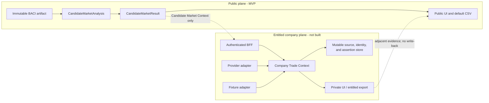

# Research: Company-level trade-data extension boundaries

**Ticket:** [Define extension boundaries for company-level trade data](https://github.com/huangyingting/HSTracker/issues/6)
**Map:** [Chart the public-data HS Tracker MVP](https://github.com/huangyingting/HSTracker/issues/1)
**Accessed:** 2026-07-11

## Decision

Preserve public analytical identity now; do not prebuild company-data
capability.

The public MVP remains exclusively BACI country-product evidence. It gains no
company table, nullable company field, provider package, authentication
scaffolding, placeholder UI, or empty provider interface. Its existing public
contract must retain the versioned source, product, economy, time, score, and
analysis identities that a later capability can use to identify one
**Candidate Market Context**.

If company-level data is pursued later, build **Company Trade Context** as a
separate authenticated and entitled module and data plane. It may consume a
Candidate Market Context and return adjacent sourced evidence, but it never
changes the canonical Candidate Market result, `cms-v1` score, rank, Data
Confidence, missing-data semantics, or default export.

| Concern | Decision |
|---|---|
| MVP facts | BACI aggregate economy-product-year facts only |
| Preserve now | Namespaced and versioned public analytical identities |
| Do not add now | Company fields/tables, provider SDKs, auth, provider secrets, extension routes, placeholders, or hypothetical ports |
| Future join scope | One Candidate Market Context: analysis, exporter economy, importer economy, and HS product |
| Future identities | Internal opaque IDs plus source-namespaced identifiers and provenance-carrying mapping assertions |
| Future module | One deep Company Trade Context module, created only with a selected provider and a fixture adapter |
| Future deployment | Authenticated/entitled process and mutable store, separate from the public runtime/artifact/cache |
| Score relationship | Additive evidence only; never a score input or confidence deduction |
| Export relationship | No licensed evidence in the default CSV; any future export is a separate entitled contract |

This is a boundary decision, not approval to buy, ingest, or expose any
company-level dataset.

## Why BACI cannot answer company questions

The actual BACI annual schema is:

```text
t,i,j,k,v,q
```

It identifies a year, exporter economy, importer economy, HS product, trade
value, and quantity. CEPII reconciles annual bilateral economy-product flows;
there is no party name, organization identifier, brand, model, transport
document, customs declaration, container, or shipment event
([CEPII BACI documentation](https://www.cepii.fr/DATA_DOWNLOAD/baci/doc/baci_webpage.html)).

Consequently, the public dataset can identify:

- one BACI release;
- one exporter/importer economy pair;
- one HS-edition product category;
- one annual recorded positive flow and its value/quantity; and
- absence of a recorded positive row.

It cannot identify:

- a Source Party Mention or Legal Entity;
- a corporate parent or subsidiary;
- a brand or model;
- a buyer, supplier, consignee, consignor, or other Party Role;
- a commercial relationship; or
- a transport document, shipment, or event.

No join, model, or inference can recover fields that are absent from the source.
Company-level evidence is a different data species with different grain,
coverage, provenance, mutability, access, and licensing.

## Domain distinctions that must survive the extension

| Term | Meaning | Conflation to prohibit |
|---|---|---|
| Candidate Market Context | The public analysis identity plus selected exporter economy, one importer economy, and HS product | Treating an economy pair as named counterparties |
| Source Party Mention | Name/address/identifier exactly as one source recorded it on one record | Treating a string as a resolved Legal Entity |
| Legal Entity | An organization or business-capacity party with independent legal identity; it may have zero or more registry identifiers | Requiring an LEI or using a display name as identity |
| Legal Entity Relationship | A sourced relationship between Legal Entities, such as a reported accounting-consolidating parent | Inferring ownership from similar names, addresses, or brands |
| Brand | A commercial product identity owned or used by a party | Treating a brand as a customs classification |
| Model | A product identity within a commercial catalog | Assuming one model maps to exactly one HS code |
| Transport document | A source-specific document with its own namespaced reference | Treating the document as a shipment or party |
| Shipment | A source-defined movement/consignment that may have multiple documents and events | Treating a shipment row as a BACI annual value |
| Shipment event | A time-stamped source event about a shipment/document/equipment movement | Treating an event ID as a shipment ID |
| Party Role | A function asserted on one record, using that source's role scheme | Relabeling consignee as buyer or consignor as supplier |
| Commercial Relationship Assertion | A separately sourced or derived claim about a commercial relationship, with evidence and time scope | Treating a transport role as proof of an ongoing relationship |

### Party Role is not commercial relationship

UNECE UN/EDIFACT code list 3035 assigns distinct codes and definitions to:

- `BY Buyer`: the party to which merchandise or services are sold;
- `CN Consignee`: the party to which goods are consigned;
- `CZ Consignor`: the party that contracts with a carrier to consign/send
  goods; and
- `AB Buyer's agent/representative`: a third party arranging a purchase for
  the buyer.

These are not synonyms
([UNECE code list 3035](https://service.unece.org/trade/untdid/d16b/tred/tred3035.htm)).
DCSA likewise models a `partyFunction` as the role of a party in the context of
a particular shipping instruction, while its Track and Trace contract gives
shipment events and transport documents separate references
([DCSA information model](https://github.com/dcsaorg/DCSA-OpenAPI/blob/5d0f8337a994e25d4605754339e14eb6bf2d1d08/domain/dcsa/dcsa_domain_v1.0.3.yaml),
[DCSA Track and Trace contract](https://github.com/dcsaorg/DCSA-OpenAPI/blob/5d0f8337a994e25d4605754339e14eb6bf2d1d08/tnt/v3/tnt.yaml)).

A future provider may explicitly assert `buyer` or `seller`; preserve that
assertion and its source. When it only supplies `consignee`, `notify party`,
`shipper`, or `consignor`, do not promote the role to buyer/supplier. Any such
derivation is a separate Commercial Relationship Assertion with a visible
method, evidence set, status, and time scope.

### Brand/model is not HS identity

The MVP product identity is a six-digit HS code paired with its HS edition.
That code describes a customs product class, not a manufacturer catalog entry.
A brand or model can map to multiple classifications across jurisdictions and
editions; an HS category can contain many brands and models. Any future mapping
is explicit, versioned, many-to-many, and sourced. It never replaces the
canonical HS identity fixed by
[MVP trade dataset and HS analysis nomenclature](./2026-07-11-mvp-trade-dataset-and-hs-nomenclature.md).

## Identifier standards and their limits

### Legal Entity Identifier

ISO 17442 defines the LEI scheme for Legal Entities relevant to financial
transactions. It includes parties able to enter contracts independently and
business-capacity cases such as sole traders, but excludes natural persons
([ISO 17442-1](https://www.iso.org/standard/78829.html)). GLEIF describes an
LEI as a unique 20-character identifier for one Legal Entity
([GLEIF, Legal Entity Identifier](https://www.gleif.org/en/organizational-identity/lei-vlei/the-legal-entity-identifier-lei)).

GLEIF Level 2 data reports direct and ultimate **accounting-consolidating**
parents. A parent's LEI is published only when that parent has one; the
relationship dataset is therefore useful but not universal
([GLEIF, Level 2 data](https://www.gleif.org/en/lei-data/access-and-use-lei-data/level-2-data-who-owns-whom)).

Decision:

- store LEI as one optional namespaced external identifier;
- never require it;
- never equate absence of an LEI with absence of a Legal Entity; and
- never infer a parent from name/address similarity.

### Economy identifiers

UN M49 publishes three-digit numeric codes for statistical processing and
cross-references ISO alpha-3 codes
([UNSD M49](https://unstats.un.org/unsd/methodology/m49/)). ISO 3166 also has
user-assigned ranges and warns that independently assigned values are not
compatible across entities
([ISO 3166](https://www.iso.org/iso-3166-country-codes.html)).

CEPII warns that BACI country codes are inherited from UN Comtrade and may
differ from standard ISO numeric codes. Therefore:

- BACI code plus BACI release remains source authority in public analysis;
- M49/ISO fields are explicit crosswalk assertions, not silent replacements;
- every crosswalk records its source and mapping kind; and
- code 490 remains `Other Asia, n.e.s. (Taiwan proxy)`, not an ISO identity.

### Source record identifiers

Provider document, shipment, event, party, location, and entity identifiers
are only unique inside their provider/dataset/version namespace. Store them as
namespaced references. Do not adopt a commercial provider's key as HS
Tracker's canonical internal identity.

## Minimum identity preserved by the public MVP

The implementation should validate wire scalars into typed value objects. The
wire format may remain compact; the namespace and version must still be
present in the containing public contract.

```ts
type SourceReleaseRef = {
  provider: 'cepii-baci'
  release: string // e.g. V202601
  artifactSha256: string
}

type ProductClassificationRef = {
  system: 'HS'
  revision: 'HS12'
  editionYear: 2012
  level: 6
  code: string // exactly six digits; leading zeroes are significant
}

type EconomyRef = {
  scheme: 'baci'
  release: string
  code: string
  crosswalks: Array<{
    scheme: 'un-m49' | 'iso-3166-1-alpha3'
    code: string
    kind: 'exact' | 'proxy'
    source: string
  }>
  proxyNote?: string
}

type CandidateMarketAnalysisRef = {
  analysisBuildId: string
  analysisId: string
  source: SourceReleaseRef
  scoreVersion: 'cms-v1'
  years: Array<{ year: number; state: 'finalized' | 'provisional' }>
  exporter: EconomyRef
  product: ProductClassificationRef
}

type CandidateMarketContext = CandidateMarketAnalysisRef & {
  importer: EconomyRef
}
```

Required behavior:

- `analysisBuildId` identifies exact source artifacts, score implementation,
  prior-release comparison input, and result schema as decided by the
  [public-web architecture](./2026-07-11-public-web-data-and-deployment-architecture.md).
- `analysisId` is deterministic for build + exporter + product.
- Candidate Market Context adds one importer; it is not a company or
  relationship ID.
- The semantic exporter/importer/product fields remain present even though a
  digest exists. A digest alone is not a durable cross-release join key.
- Internal numeric product IDs and display names never become public identity.
- The result contract exposes these identities. The exact CSV columns remain
  owned by the result-export decision; this ticket does not preempt it.

These fields already describe public analytical provenance. Preserving them is
not speculative company functionality.

## Future Company Trade Context model

This section records a model for future planning. It creates no current schema.

### Source and provenance

```ts
type SourceRecordRef = {
  provider: string
  dataset: string
  datasetVersion?: string
  recordType: string
  recordId: string
}

type Provenance = {
  sourceRecord: SourceRecordRef
  retrievedAt: string
  sourceEffectiveAt?: string
  transformationVersion?: string
  usePolicyId: string
  retentionUntil?: string
}
```

`usePolicyId` points to the reviewed provider agreement/policy and its allowed
uses. It is not a conclusion that every provider has the same rules.

### Identity and assertions

```ts
type ExternalIdentifier = {
  scheme: string
  value: string
  issuer?: string
  validFrom?: string
  validTo?: string
}

type SourcePartyMention = {
  id: string
  source: SourceRecordRef
  sourceLocalId?: string
  recordedName?: string
  recordedAddress?: string
  externalIdentifiers: ExternalIdentifier[]
  provenance: Provenance
}

type LegalEntity = {
  id: string // opaque internal ID
  externalIdentifiers: ExternalIdentifier[]
}

type ResolutionAssertion = {
  id: string // opaque assertion ID
  mentionId: string
  legalEntityId: string
  method: 'registry-exact' | 'provider-supplied' | 'model' | 'human-reviewed'
  status: 'candidate' | 'confirmed' | 'rejected' | 'superseded'
  supersedesAssertionId?: string
  confidence?: { value: number; scale: string; modelVersion?: string }
  validFrom?: string
  validTo?: string
  provenance: Provenance[]
}
```

Names and addresses are observations used during resolution, never join keys.
Resolution is many-to-many and time-aware. A confidence value without its scale
and model version is not portable and must not be presented as Data
Confidence.

### Relationships, products, and logistics

Model these as separate sourced assertions. Every assertion has its own opaque
ID and may name the assertion it supersedes so corrections remain auditable:

- Legal Entity Relationship: subject, object, relationship kind, effective
  dates, provenance, and resolution status.
- Party Role: Source Party Mention/Legal Entity, source record, role-code
  scheme, role code, and provenance.
- Commercial Relationship Assertion: subject, object, relationship kind,
  evidence/method, effective dates, status, and provenance.
- Brand and model: opaque internal identities with namespaced external
  identifiers and sourced ownership/use assertions.
- Product-classification mapping: brand/model/product identity to a versioned
  classification reference, many-to-many, with jurisdiction, method,
  confidence/status, dates, and provenance.
- Transport document: namespaced document reference and type.
- Shipment: separate namespaced source identity.
- Shipment event: separate event identity, event type/time, and links to source
  shipment/document/equipment references.
- Location: a namespaced location identifier when supplied, plus unresolved
  source text; never join only on a city string.

Do not sum shipment records into BACI values by default. Provider coverage,
valuation, modes, confidentiality, timing, and document duplication differ
from BACI's reconciled annual aggregate.

## Future module seam

Do not add this interface or directory during MVP implementation. It is a
design target for a later provider-specific effort.

```ts
type AccessContext = {
  tenantId: string
  principalId: string
  entitlementSnapshotId: string
}

type CompanyTradeContextResult =
  | { kind: 'evidence'; evidence: CompanyEvidence[] }
  | { kind: 'no-evidence'; coverage: CoverageStatement[] }

interface CompanyTradeContext {
  get(
    context: CandidateMarketContext,
    access: AccessContext,
  ): Promise<CompanyTradeContextResult>
}
```

Interface invariants:

- one importer is required; there is no bulk "all Candidate Markets" company
  query;
- the access context is created by trusted authenticated server code, never
  from a browser-supplied token payload;
- entitlement is checked before provider fetch, persistence, cache lookup/write,
  rendering, or export;
- `no-evidence` is not "no trade" and carries provider coverage;
- not-entitled, use-not-permitted, provider-unavailable, and internal failures
  are distinct typed errors;
- every evidence item carries provenance and applicable use policy;
- no result mutates or wraps the public `CandidateMarketResult`; and
- company resolution quality is not `cms-v1` Data Confidence.

When the capability is real, expose the module through a concrete constructor
or function rather than creating an interface plus one pass-through
implementation. Its internal provider port becomes justified by two adapters:
the selected provider adapter and an in-memory fixture adapter used through the
module's interface. Until then, the codebase has neither.

## Deployment, access, and licensing separation

The future capability may share a repository, design system, and visual shell.
It does not share the public process or data plane.

| Surface | Public MVP | Future Company Trade Context |
|---|---|---|
| Authentication | None | Required |
| Authorization | Public allowlisted query | Tenant, principal, provider, field, action, and export entitlements |
| Runtime | Public Next.js/DuckDB deployment | Separate authenticated deployment/BFF |
| Store | Immutable BACI DuckDB artifacts | Separate mutable operational store |
| Secrets | BACI artifact read credential only | Provider credentials server-side only |
| Cache | Public immutable HTTP/LRU | Partitioned after entitlement; private/no-store by default |
| Object storage | BACI-derived artifacts | Separate private encrypted storage if provider terms permit |
| Logs/analytics | Public query identities | No licensed names/addresses/payloads; access-controlled audit metadata |
| Export | Public evidence CSV | Separate contract and route, only when provider terms and entitlement permit |
| Retention | Immutable accepted releases | Provider/policy-specific retention, deletion, correction, and legal hold |

The ImportGenius website terms demonstrate why terms cannot be inferred: public
website content has stated reuse restrictions, while purchased products are
governed by a separate Commercial Agreement
([ImportGenius Website Terms](https://www.importgenius.com/utilities/legal/terms-of-use)).
This does **not** determine the terms of any future subscription. It determines
the architecture rule: before selecting a provider, inspect that provider's
actual agreement and record allowed fetch, storage, caching, display, export,
derivation, model-training, retention, deletion, and audit behavior in an
enforced use policy.

No licensed evidence enters:

- the public DuckDB artifact or object-store prefix;
- public HTTP/CDN/process caches;
- an unauthenticated route;
- the default Candidate Market result or CSV;
- client-visible configuration;
- public logs, analytics, or error bodies; or
- `cms-v1` score, rank, or Data Confidence.

## Coverage and privacy are provider facts

U.S. vessel-manifest disclosure illustrates source-specific coverage. 19 CFR
103.31 distinguishes outward and inward manifests, lists particular public AMS
fields such as bill-of-lading number, shipper, consignee, notify party, goods
description, and container number, and permits confidentiality requests that
remove named fields
([19 CFR 103.31](https://www.ecfr.gov/current/title-19/chapter-I/part-103/section-103.31)).
It says nothing about every country, transport mode, provider, or buyer/seller
relationship. A future connector must publish its own jurisdiction, mode,
period, role, redaction, revision, and known-coverage statement.

GDPR Article 4(1) defines personal data by relation to an identified or
identifiable natural person. Recital 14 excludes data concerning legal persons
as such, but Source Party Mentions can contain sole-trader names, contacts, or
addresses relating to natural persons
([Regulation (EU) 2016/679](https://eur-lex.europa.eu/eli/reg/2016/679/oj)).
The actual provider, data, users, and jurisdictions require privacy review
before implementation. This document is not legal advice.

## What the MVP does now

1. Preserve the public identities listed above in domain types and result
   provenance.
2. Keep BACI source codes authoritative and crosswalks explicit.
3. Keep `CandidateMarketAnalysis.analyze` focused on public evidence.
4. Keep Company Trade Context terms in the domain glossary so later work does
   not conflate them.
5. Publish this boundary as planning input.

## What the MVP explicitly does not do

- No company, party, brand, model, relationship, document, shipment, event, or
  location table.
- No optional `companyId`, `buyerName`, `supplierName`, `shipmentId`, or
  `brand` field in a public type.
- No commercial provider SDK or sample credentials.
- No provider port, adapter, fake adapter, or company module.
- No login, tenant, role, entitlement, or billing scaffold solely for this
  future capability.
- No disabled "company data" tab, waitlist, route, or feature flag.
- No claim that BACI or `cms-v1` identifies companies or shipments.
- No company evidence in public caches, logs, analytics, exports, or artifacts.

## Additive integration later

If a provider is eventually selected:

1. research its API, coverage, record semantics, corrections, and agreement;
2. define and test its use policy before downloading data;
3. build the Company Trade Context module with a provider and fixture adapter;
4. store source records and mapping assertions in the separate entitled plane;
5. link from one Candidate Market Context after authentication;
6. show sourced company evidence adjacent to public evidence with separate
   coverage and resolution quality;
7. keep the public result byte-for-byte independent of company evidence; and
8. add a separate entitled export only if the agreement permits it.

## Architecture diagram



## Rejected approaches

| Approach | Why rejected |
|---|---|
| Add nullable company fields now | Promises unsupported semantics and invites leakage into public surfaces |
| Add empty company tables/module/ports | Speculative design with no real provider or capability |
| Key future joins by display name | Names are neither unique nor stable; resolution needs explicit sourced assertions |
| Require LEI | LEI is useful but not a universal identifier for trade parties |
| Treat consignee/consignor as buyer/supplier | Official role schemes define them separately |
| Treat brand/model as HS code | Commercial product identity and customs classification are different, many-to-many concepts |
| Aggregate shipment values into BACI | Grain, valuation, coverage, duplication, time, and confidentiality differ |
| Share public runtime/cache/export | Licensed evidence requires authentication, entitlement, use-policy, and retention controls |
| Let company evidence affect `cms-v1` | Changes a fixed public aggregate score with inaccessible and provider-dependent inputs |

## Acceptance checks

- Public contracts preserve analysis build/release/artifact, score version,
  years, exporter/importer source identities, and HS system/edition/code.
- Product codes retain leading zeroes and economy crosswalks never replace the
  BACI source code.
- The implementation contains no company-shaped public field, table, route,
  module, provider dependency, auth scaffold, or placeholder UI.
- Public score/rank/confidence and export are independent of company data.
- `no recorded bilateral flow` is never presented as evidence that no company
  shipment or relationship exists.
- The future seam requires one Candidate Market Context and trusted access
  context, with typed entitlement/use/availability failures.
- Future identity resolution is namespaced, many-to-many, time-aware, and
  provenance carrying; display names are not join keys.
- Licensed data cannot reach public storage, cache, logs, analytics, result, or
  export by default.

## Risks and future questions

| Risk/question | Boundary |
|---|---|
| Provider terms differ | Review and encode each actual agreement; do not inherit assumptions from this research |
| Coverage omits modes/roles/countries or confidential records | Return a provider-specific coverage statement; absence is unknown |
| Party mention resolves incorrectly | Keep mention and entity distinct; record method, status, time, provenance, and calibrated confidence |
| Privacy regime differs | Review actual data/users/jurisdictions before ingest |
| Future UI makes company evidence look like score evidence | Separate labels, provenance, coverage, and resolution quality |
| Historical analysis build is retired | Join using the semantic Candidate Market Context fields as well as analysis provenance |
| Provider supports bulk lookup | Preserve the one-context module interface unless a separate entitled bulk use case is explicitly approved |

Provider selection, provider agreements, identity-resolution tooling, auth
model, storage engine, retention periods, and private-export columns remain
future decisions. None blocks the public MVP.

## Primary sources

All sources were accessed 2026-07-11.

- CEPII,
  [The CEPII-BACI dataset](https://www.cepii.fr/DATA_DOWNLOAD/baci/doc/baci_webpage.html)
- ISO,
  [ISO 17442-1 Legal Entity Identifier](https://www.iso.org/standard/78829.html)
  and
  [ISO 3166 country codes](https://www.iso.org/iso-3166-country-codes.html)
- Global Legal Entity Identifier Foundation,
  [The Legal Entity Identifier](https://www.gleif.org/en/organizational-identity/lei-vlei/the-legal-entity-identifier-lei)
  and
  [Level 2 Data: Who Owns Whom](https://www.gleif.org/en/lei-data/access-and-use-lei-data/level-2-data-who-owns-whom)
- United Nations Statistics Division,
  [M49 Standard Country or Area Codes](https://unstats.un.org/unsd/methodology/m49/)
- UNECE,
  [UN/EDIFACT code list 3035, Party function code qualifier](https://service.unece.org/trade/untdid/d16b/tred/tred3035.htm)
- Digital Container Shipping Association,
  [information-model party function](https://github.com/dcsaorg/DCSA-OpenAPI/blob/5d0f8337a994e25d4605754339e14eb6bf2d1d08/domain/dcsa/dcsa_domain_v1.0.3.yaml)
  and
  [Track and Trace contract](https://github.com/dcsaorg/DCSA-OpenAPI/blob/5d0f8337a994e25d4605754339e14eb6bf2d1d08/tnt/v3/tnt.yaml)
- U.S. Government,
  [19 CFR 103.31](https://www.ecfr.gov/current/title-19/chapter-I/part-103/section-103.31)
- European Union,
  [Regulation (EU) 2016/679](https://eur-lex.europa.eu/eli/reg/2016/679/oj)
- ImportGenius,
  [Website Terms of Service](https://www.importgenius.com/utilities/legal/terms-of-use)
- HSTracker,
  [MVP trade dataset and HS analysis nomenclature](./2026-07-11-mvp-trade-dataset-and-hs-nomenclature.md),
  [Candidate Market Score and Data Confidence](./2026-07-11-candidate-market-score-and-confidence.md),
  and
  [Public-web data and deployment architecture](./2026-07-11-public-web-data-and-deployment-architecture.md)
