# Research: Public-web data and deployment architecture

**Ticket:** [Choose the public-web data and deployment architecture](https://github.com/huangyingting/HSTracker/issues/5)  
**Map:** [Chart the public-data HS Tracker MVP](https://github.com/huangyingting/HSTracker/issues/1)  
**Accessed:** 2026-07-11

## Decision

Build the public application as a self-hosted **Next.js App Router application
in TypeScript**, running in the Node.js runtime. Embed DuckDB through
`@duckdb/node-api` and open immutable analytical artifacts from local persistent
storage in read-only mode.

A separate offline pipeline will turn one pinned BACI release into:

1. validated Parquet staging data;
2. one compact native DuckDB artifact;
3. a provenance manifest containing source and artifact checksums; and
4. an immutable analysis release catalog that names the current and previous
   supported artifacts;
5. an independently versioned product-search catalog; and
6. a deployment manifest pairing compatible analysis and product-search builds.

A separate source monitor publishes small immutable freshness-status snapshots
and a mutable pointer. The runtime reads them with read-only credentials; they
never alter analysis bytes.

The public process serves analysis from the current artifact and uses the
previous artifact internally for rollback and the `cms-v1` Release Revision
comparison. Both artifacts are recomputed independently with the current score
window; their rows are never mixed in one score. Object storage remains the
durable source of truth; local volume files are reconstructible serving copies.

| Area | MVP choice |
|---|---|
| Web runtime | Next.js App Router, TypeScript, Node.js, standalone Docker output |
| Analytical runtime | Embedded DuckDB via `@duckdb/node-api` |
| Runtime data | Native `.duckdb` files, current plus previous release, opened read-only |
| Offline staging | Validated annual CSV to Parquet, then compacted DuckDB |
| Deployment | One always-on Fly.io Machine and Fly Volume as the concrete baseline |
| Durable artifacts | Private S3-compatible object storage under immutable keys |
| Public interface | Versioned, `GET`-only Route Handlers; no raw-data or refresh endpoint |
| Main module seam | One `CandidateMarketAnalysis.analyze(query)` interface |
| Cache identity | Immutable analysis build + exporter + product |
| Product discovery identity | Independent immutable product-search build |
| Freshness identity | Independent immutable operational-status snapshot |
| Release change | Publish exact analysis/search catalogs, then deploy their pairing manifest |
| Initial availability trade-off | One Machine may have a short recovery/deploy outage; a second identical Machine is the HA path |

The architecture is host-portable: the application image, deployment manifest,
DuckDB files, and module interfaces do not contain Fly.io-specific business
logic.

## Binding inputs

This decision consumes, rather than changes, the prior decisions:

- [MVP trade dataset and HS analysis nomenclature](./2026-07-11-mvp-trade-dataset-and-hs-nomenclature.md):
  one pinned CEPII BACI HS12 release; ingest 2012-2024; do not mix releases;
  keep 2024 provisional; preserve missing rows as unknown/no recorded positive
  flow.
- [Candidate Market Score and data confidence](./2026-07-11-candidate-market-score-and-confidence.md):
  `cms-v1` uses the five latest Finalized Years, recomputes 3-, 5-, and 10-year
  windows ending at the same cutoff, and exposes complete evidence and
  provenance. The initial windows end in 2023.
- [Candidate Market discovery workflow](https://github.com/huangyingting/HSTracker/issues/3):
  one focused master-detail workspace with adjacent evidence, a secondary
  comparison tray, and contextual export.
- [HS product descriptions and search language](./2026-07-11-hs-product-description-and-search-language.md):
  exact BACI English source descriptions, a separately versioned Simplified
  Chinese auxiliary catalog, deterministic bilingual search, and no silent
  cross-revision conversion.
- [Trade-data freshness and provisional-year presentation](./2026-07-11-trade-data-freshness-and-provisional-presentation.md):
  absolute source scope, rolling finalized windows, separately labelled
  provisional evidence, explicit refresh states, and same-window release
  comparison.

The deployment must not turn a Candidate Market into a prediction or
recommendation. It only serves the descriptive analysis defined by `cms-v1`.

## Scale and query shape

### Measured source facts

The pinned `BACI_HS12_V202601.zip` archive is 1,267,950,839 bytes. The sampled
annual files contain:

| Year | Rows | Uncompressed CSV bytes |
|---|---:|---:|
| 2012 | 9,012,155 | 293,857,522 |
| 2023 | 11,755,559 | 381,982,615 |
| 2024 | 11,109,411 | 361,446,720 |

There are 5,202 HS12 products and about 226 observed exporter/importer codes
per year.

### Planning estimates

The following are estimates and must be replaced by measured pipeline output:

- 2012-2024 contains roughly **130-140 million** annual bilateral rows.
- At about 32.5 uncompressed bytes per sampled CSV row, the annual CSV members
  total roughly **4.2-4.8 GB**.
- One product averages roughly `136M / 5,202`, or **26,000 annual supplier
  rows** across all years. Popular products will be materially larger.
- The upper bound for observed `(year, importer, product)` market rows is
  `13 * 226 * 5,202`, or **15.3 million**.
- There are `226 * 5,202`, or **1,175,652**, possible exporter-product query
  keys before excluding unsupported combinations.

One analysis does not need to scan the full dataset. It needs:

1. observed annual market totals for one product;
2. annual bilateral values for one selected exporter and product;
3. sufficient supplier-concentration statistics for those market-years; and
4. annual world totals for that product.

The result contains at most about 226 Candidate Markets. The explanation-rich
JSON is likely tens to hundreds of kilobytes before compression. Even an
unrealistically low 10 KB average multiplied by 1.176 million query keys is
about 12 GB and more than a million objects. A complete precomputed corpus is
therefore a poor publication unit even before actual result sizes are measured.

The native DuckDB artifact size is not yet known. Use a **2-6 GB planning
envelope**, not a promise. The release manifest records the measured size, and
volume sizing is gated on it.

## Option comparison

| Option | Advantages | Costs and failure modes | Decision |
|---|---|---|---|
| Partitioned Parquet queried by DuckDB at runtime | Open, inspectable format; projection and filter pushdown; easy offline staging | Runtime must discover/read Parquet metadata and manage many files; no single checksum/cutover unit; remote object reads add network variance | Use for staging, not the serving artifact |
| Native persistent DuckDB artifact | One checksum and atomic publication unit; embedded; columnar; automatic zonemaps; no database server | Requires a long-lived native Node process and local artifact; HA is operated at the application replica level | **Choose** |
| PostgreSQL with relational aggregates | Mature concurrency, B-tree/BRIN indexes, managed HA options | A second mutable service, migrations, pool, backups, and large indexed fact table for an annually replaced read-only dataset | Defer until write-heavy or relational extensions require it |
| ClickHouse/analytical service | Strong scans, ordering, partitioning, and scale-out | Separate service and operational/cost surface designed for much larger or continuously ingested workloads | Reject for MVP |
| Precomputed JSON for every query | Static serving and trivial cache hits | At least 1.176 million objects; likely tens of GB; long builds; awkward all-or-nothing publication | Reject |
| DuckDB-Wasm in the browser | No server query engine | Would ship a large analytical dataset to every analyst, expose bulk facts, and exceed a reasonable browser payload | Reject |

DuckDB's Parquet reader supports projection and filter pushdown, so Parquet
remains the right inspectable intermediate format. A native database file is a
better serving format because it is one immutable object with persisted storage
statistics and a single checksum.

PostgreSQL can support the access pattern with B-tree or BRIN indexes, but the
MVP does not need a network database or concurrent writes. ClickHouse
`MergeTree` is explicitly designed around high ingest rates and huge data
volumes; that capability is disproportionate to one small annual release.

## Runtime artifact

### Tables

The artifact is a validated analytical projection, not the original ZIP or CSV
files.

#### `bilateral_year`

One row per observed positive BACI `(year, exporter, importer, product)` flow:

```text
year
product_id
exporter_code
importer_code
value_kusd
```

- Estimated 130-140 million rows.
- Preserve the source numeric precision in a validated fixed-point type.
- Physically order by `(product_id, exporter_code, year, importer_code)`.
- Do not retain source CSV text or expose this table through a public endpoint.

The table remains necessary because the export economy is selected at request
time. Precomputing that bilateral lookup for every possible exporter-product
analysis either reproduces this grain or expands it into the much larger full
result corpus.

#### `market_year`

One row per observed `(year, importer, product)` market:

```text
year
product_id
importer_code
world_value_kusd
supplier_count
supplier_value_square_sum
source_flow_count
quantity_present_count
quantity_sum_tons
```

This table is no larger than 15.3 million rows and is ordered by
`(product_id, year, importer_code)`.

`supplier_count`, total value, and the sum of squared supplier values are
sufficient to calculate normalized HHI after excluding any selected exporter:

```text
alternative_count = supplier_count - observed_selected_exporter
alternative_total = world_value - selected_exporter_value
alternative_square_sum =
    supplier_value_square_sum - selected_exporter_value^2
```

The computation preserves whether the selected bilateral row was observed.
When it was not observed, zero is used only as its contribution to the BACI
ratio, exactly as `cms-v1` specifies; the evidence state remains
`NOT_RECORDED`, never `OBSERVED_ZERO`.

Quantity counts support the separate quantity-completeness evidence without
shipping nullable row-level quantity into the runtime fact table. Quantity
does not affect score or Data Confidence.

#### `product_year`

One row per observed `(year, product)`:

```text
year
product_id
world_value_kusd
```

This small table supports the full-period discontinuity check.

#### Dimensions and metadata

```text
economy(code, display_name, kind, is_taiwan_proxy, ...)
product(product_id, hs12_code, source_description, ...)
artifact_metadata(key, value)
```

The API keeps HS12 codes as six-character strings so leading zeroes remain
significant. An internal integer `product_id` is only a storage optimization.
Search aliases or translations belong to the separate product-language
decision and must not change canonical identity.

### Query plan

For an exact `(release, score version, exporter, product)` query:

1. validate release, score version, exporter, and six-digit product against
   loaded metadata;
2. read `market_year` rows for the product;
3. read `bilateral_year` rows for the product and selected exporter;
4. read `product_year` rows for the product;
5. construct typed `cms-v1` inputs that preserve observed versus not-recorded
   states;
6. compute primary and alternate-window cohorts in the domain module;
7. compare with the previous release when a compatible prior analysis exists;
8. return one deterministic result.

The physical ordering lets DuckDB's automatic min-max zonemaps skip unrelated
row groups. Do **not** add an ART index by default. DuckDB recommends ART for
very selective queries but also requires the index to fit in memory; an index
over roughly 136 million rows must be justified by measured build memory,
artifact size, and worst-product latency.

## Deep module and seams

### Public application seam

Route Handlers and rendering code use one deep module:

```ts
type CandidateMarketAnalysisQuery = {
  analysisBuildId: string
  exporterCode: string
  productCode: string
}

interface CandidateMarketAnalysis {
  analyze(
    query: CandidateMarketAnalysisQuery,
  ): Promise<CandidateMarketResult>
}
```

The interface includes these invariants:

- `productCode` is the canonical six-character HS12 code;
- the analysis build must be the loaded immutable build;
- the result is deterministic for the complete query key;
- candidates are ordered by displayed integer score, competition rank, then
  numeric economy code;
- a valid query with no eligible cohort returns an empty result, not an error;
- malformed, unknown, retired, unavailable, and internal-failure errors are
  distinct typed outcomes.

The implementation hides:

- allowlist validation;
- DuckDB connections and prepared SQL;
- market/bilateral joins;
- observed-versus-not-recorded semantics;
- all three `cms-v1` window calculations;
- midrank ties, half-up rounding, rank, confidence, and flags;
- revision comparison;
- request coalescing and process caching; and
- provenance assembly.

Deleting this module would spread score and data semantics into every route,
page, and export path, so the seam earns its place.

### Internal evidence seam

The analysis implementation has one internal seam:

```ts
interface TradeEvidenceSource {
  loadCmsV1Inputs(
    query: CandidateMarketAnalysisQuery,
  ): Promise<CmsV1Inputs>
}
```

It has two real adapters:

- `DuckDbTradeEvidenceSource` for the immutable artifact;
- `FixtureTradeEvidenceSource` for score and acceptance fixtures.

`CmsV1Inputs` uses a tagged state for bilateral evidence and omits unobserved
market-years rather than filling a dense grid with zeroes. Pure domain
functions calculate the score from this normalized input. DuckDB performs
set aggregation; TypeScript owns versioned business semantics.

Catalog search is a separate module because the pending description/language
decision owns its matching behavior. It can use release dimensions in memory
without expanding the analysis interface.

## Result contract

Every `CandidateMarketResult` includes:

- deterministic analysis ID;
- analysis build ID and release-catalog checksum;
- BACI release, artifact build ID, artifact schema version, artifact SHA-256,
  and score version;
- the previous artifact identity used for revision comparison, when present;
- source update date, HS revision, finalized/provisional years, canonical score
  window, and nominal-current-USD units;
- selected exporter and product identities;
- cohort size and an explicit empty-state reason when zero;
- integer score, competition rank, and tie ordering;
- all four fixed weights;
- each raw indicator, component state, integer percentile, unit, and years
  used;
- observed/not-recorded bilateral state and required wording;
- Data Confidence integer, label, and every deduction;
- alternate-window stability, discontinuity, extreme-growth, dominant-size,
  and typed Release Revision comparison states and deltas;
- quantity completeness as separate evidence; and
- the discovery-aid disclaimer.

Do not include a request-time `generatedAt` in the immutable payload. The
manifest's source/build dates provide meaningful provenance without making
equal analyses byte-different. Operational freshness is joined from its
separately versioned status snapshot and does not enter
`CandidateMarketResult`.

## Public HTTP interface

Use Node-runtime Next.js Route Handlers:

```text
GET /api/v1/analyses/current
GET /api/v1/analyses/{analysisBuildId}/economies?q=
GET /api/v1/product-catalogs/{productSearchBuildId}/products?q=&locale=&limit=
GET /api/v1/analyses/{analysisBuildId}/candidate-markets
GET /api/v1/analyses/{analysisBuildId}/candidate-markets.csv?exporter=&product=&productSearchBuildId=&freshnessStatusId=&schema=candidate-markets-csv-v1
GET /healthz
```

The analysis route accepts only `exporter` and `product`. CSV additionally
binds the accepted product catalog used for its bilingual labels, the immutable
public freshness-status snapshot presented at download, and the requested
export schema.
Alternate 3-, 5-, and 10-year calculations are part of `cms-v1` evidence, not a
public score-window selector. The immutable deployment manifest supplies the
human-readable BACI release and score version. The short-lived current response
also names the compatible product-search build and freshness-status snapshot.
Product search and operational freshness are versioned independently because
neither changes trade facts or score computation.

The comparison tray operates on candidates already returned by one analysis;
it does not need a second comparison endpoint. The canonical CSV always exports
the complete eligible cohort from the same `CandidateMarketResult` as the
visible result. It does not accept a selected row, shortlist, viewport, or
arbitrary candidate list. The serializer adds compatible product-catalog labels
and status-snapshot provenance without changing analysis facts. The client
refreshes `current` immediately before export and binds its compatible product-
search build and effective freshness-status IDs. The exact shape and byte
contract are defined in the
[result export contract](./2026-07-11-result-export-contract.md).

Analysis-route response behavior:

| Condition | Response |
|---|---|
| Valid analysis | `200` with complete versioned result |
| Valid query, no eligible market | `200` with empty candidates and reason |
| Malformed code or query | `400` with stable error code |
| Well-formed economy/product absent from release | `404` |
| Analysis build is no longer active at the origin | `410` and client refreshes `current` |
| Artifact not loaded or incompatible | `503` |
| Unexpected failure | `500` with opaque public message and logged correlation ID |

The CSV route adds product-catalog, status-snapshot, schema, and representation-
limit outcomes defined in the result export contract; the JSON analysis route
does not accept those IDs.

No public route writes data, activates a release, accepts SQL, or returns raw
BACI facts.

## Caching

### Identity

The analysis build ID is a digest over the exact current artifact, compatible
previous artifact (or `none`), score implementation/version, result schema,
and analysis release catalog. The product-search catalog and deployment
manifest are excluded from this digest. The semantic cache key is:

```text
analysis_build_id
  + exporter_code
  + product_code
```

This prevents a Release Revision input or implementation correction from
silently changing bytes at an existing URL. Explicit release and score versions
remain in the response for humans.

Product discovery has a separate immutable identity:

```text
product_search_build_id
  + normalized_query
  + locale
  + limit
```

The product-search build digests the source product catalog, accepted
translations and aliases, normalization/ranking implementation, and response
schema. The selected analysis identity remains `HS12` plus the six-character
product code.

An export that embeds operational state has a third identity:

```text
analysis_build_id
  + exporter_code
  + product_code
  + product_search_build_id
  + freshness_status_id
  + export_schema_version
```

The product-search build enters only the export identity because the CSV embeds
its accepted Simplified Chinese product description and translation status.
Changing a translation therefore creates new export bytes without falsely
changing analysis identity.

The effective freshness-status ID is a structured content address containing
the immutable source-snapshot ID, effective state/time, and a digest over the
public fields: check and deadline times, served release, latest known release,
newer-release detection time, effective time, and typed state. This lets the
runtime reload the retained source snapshot and reproduce a deadline transition
after restart without a write or in-memory mapping. The served release must
match the analysis release. A changed check, deadline transition, or refresh
result creates a new export URL; bytes at an existing URL remain immutable.

### Layers

1. **In-flight coalescing:** concurrent requests for one key share one
   calculation.
2. **Process LRU:** byte-bounded, not merely entry-count-bounded. Start with a
   conservative 64-128 MiB envelope and finalize it under the performance
   ticket.
3. **HTTP shared cache:** versioned analysis, search, and status-bound export
   responses are immutable and may use a long shared-cache lifetime. A concrete
   starting policy is
   `public, max-age=86400, s-maxage=31536000, stale-while-revalidate=604800,
   immutable`.
4. **Current manifest:** combine deployed build identities with the latest
   effective freshness-status snapshot and use a short policy such as
   `max-age=60, s-maxage=300`. Never cache it past the next seven- or 14-day
   state-transition deadline.
5. **Health and errors:** health is `no-store`; do not long-cache failures or
   malformed queries.

Fly.io is not assumed to be a CDN. These headers benefit browsers and any
explicitly configured CDN/reverse proxy. The single-process cache remains the
baseline.

Next.js's self-hosted cache works on local disk, but it is not the source of
truth for analytical identity. The explicit analysis LRU is easier to bound,
coalesce, instrument, and test. If replicas are added, each has an independent
LRU and the HTTP cache is the shared layer; Redis is not justified for the
MVP.

The origin guarantees only the active analysis build. An old cached response
remains valid because its URL is immutable, but an old cache miss receives
`410`; the client reloads `/api/v1/analyses/current` and repeats the query.
Older artifacts remain in private object storage for reproducibility. The
previous artifact loaded by the process is an internal comparison/rollback
input, not a promise of a historical public query interface.

## Source freshness process

The source monitor is operational control-plane work, not part of a public
request:

1. Check CEPII daily in January-February and at least weekly otherwise.
2. Publish an immutable status snapshot for every successful check, release
   detection, validation failure, promotion, or explicit rollback.
3. Update one small pointer only after the snapshot is durable.
4. Treat no successful check for 14 days as `CHECK_OVERDUE`.
5. Treat a detected release as `UPDATE_IN_PROGRESS` for at most seven days.
6. Publish `REFRESH_DELAYED` immediately after a validation/promotion failure or
   after the seven-day target.

The runtime reads the pointer and named snapshot with read-only object-storage
credentials. If refresh fails, the existing deployment manifest and complete
artifact keep serving. If status retrieval fails, a cached snapshot may be used
to derive the deadline transition. The deployment manifest includes the last
known snapshot as a startup fallback. State evaluation accepts an explicit UTC
`asOf` instant; at `checked_at + 14 days` or `detected_at + 7 days`, it derives a
stable effective snapshot using that deadline as `effective_at`, not request
time. The application must not silently continue to claim `LATEST_KNOWN`.

Readiness remains successful while a valid accepted artifact is serving, with a
degraded freshness field for operators. An unreadable or incompatible active
artifact remains a `503` availability failure.

## DuckDB process model

- Start one DuckDB instance and attach the current and previous files
  `READ_ONLY`, or use equivalent read-only instances if the Node client makes
  attachment lifecycle less reliable. Verify the chosen form in an integration
  test.
- Maintain a small bounded connection pool. Never overlap unrelated queries on
  one connection and assume that constitutes concurrency.
- Put a global semaphore in front of analytical work. Request coalescing handles
  identical keys; the semaphore bounds different-key work.
- Tune pool size and DuckDB `threads` together to avoid CPU oversubscription.
- Set DuckDB `memory_limit` below the container cgroup limit and place any
  bounded spill directory on the volume, separate from immutable artifacts.
- Use prepared parameters after allowlist validation; never interpolate public
  query values into SQL.
- Mark artifact files read-only at the filesystem level as defense in depth.

The exact pool, thread, memory, timeout, and queue limits belong to the
performance/caching ticket and must be load-tested against the highest-row-count
products, cold page cache, cache misses, and concurrent distinct keys.

## Offline publication pipeline

Implement a TypeScript CLI that orchestrates DuckDB SQL. Heavy row processing
stays in DuckDB rather than crossing 130 million rows through JavaScript.
Pipeline code, schemas, fixtures, and source pins live in git; archives,
Parquet, and DuckDB artifacts do not.

### Source pin

Commit a source descriptor containing:

- exact CEPII URL and BACI release;
- expected byte count and SHA-256;
- HS revision and member years;
- source update date and licence/attribution text; and
- the human approval that established the initial pin.

If CEPII replaces bytes at the same URL, the checksum mismatch fails closed.

### Build sequence

1. Download the pinned ZIP over HTTPS to temporary build storage.
2. Verify byte count, SHA-256, ZIP member CRCs, expected members, and no unsafe
   archive paths.
3. Validate the exact `t,i,j,k,v,q` header and explicit types.
4. Validate year/member agreement, positive `v`, null-or-positive `q`,
   source numeric scale, unique `(i,j,k)` per year, and complete metadata joins.
5. Record annual row, exporter, importer, product, and quantity-null counts.
6. Compare coverage with the pinned release and previous accepted build; require
   explicit approval for unexplained drift rather than silently accepting it.
7. Write year-partitioned Parquet staging data with explicit schema.
8. Build `bilateral_year`, `market_year`, `product_year`, dimensions, and
   metadata in a fresh DuckDB file.
9. Physically order tables, run `ANALYZE` and `CHECKPOINT`, then record table
   counts, database size, storage version, and build timings.
10. Reopen the file read-only through the production evidence adapter.
11. Run schema checks, source reconciliations, the worked `cms-v1` fixture, and
    the decision-complete acceptance fixtures once that ticket publishes them.
12. Benchmark representative sparse, median, and maximum-row products. An
    artifact cannot be promoted if it misses the later performance gates.
13. Compute the final artifact SHA-256 and write an immutable manifest.

### Manifest

The manifest contains at least:

```text
baci_release
source_url
source_bytes
source_sha256
source_update_date
license
hs_revision
ingested_years
finalized_years
provisional_years
finalized_cutoff_year
score_window_start
score_window_end
annual_source_checks
pipeline_git_sha
duckdb_version
artifact_schema_version
artifact_bytes
artifact_sha256
table_row_counts
score_versions_supported
built_at
```

### Publish and promote

1. Upload the artifact and manifest to private immutable keys such as
   `releases/V202601/{artifactSha256}/`.
2. Ask object storage to validate the upload checksum and read it back before
   promotion.
3. Create an immutable analysis release catalog naming the exact current and
   previous artifact manifests.
4. Derive an immutable analysis build ID from that catalog, score
   implementation/version, and result schema.
5. Publish an immutable product-search catalog and derive its independent build
   ID from source products,
   accepted localization/alias assets, search implementation, and response
   schema.
6. Create and deploy an exact manifest pairing the analysis catalog/build with
   the compatible product-search catalog/build.
7. Download missing artifacts to `.partial` files, verify SHA-256, fsync, and
   atomically rename before opening.
8. Start the application only after schema compatibility, catalog validation,
   product-search fixtures, and smoke analysis
   succeed.

Any failure before activation leaves the currently deployed pairing manifest
untouched.
Object storage retains all accepted immutable releases; the serving volume
keeps current, previous, and temporary download headroom.

On a single Machine, initial download or restart can cause a short outage. A
second Machine with its own reconstructed volume enables a rolling cutover.
The artifacts do not need volume-to-volume replication because both replicas
verify the same immutable object.

## Next.js and container details

- Use App Router and Route Handlers in the Node runtime, not Edge.
- Set `output: 'standalone'`.
- Pin Node.js, Next.js, DuckDB, and the artifact schema version.
- Use a glibc-based minimal image, not Alpine/musl unless the DuckDB native
  binary is explicitly proven compatible.
- Add `@duckdb/node-api` to `serverExternalPackages`; verify its native binary
  is present in standalone output with a container integration test.
- Run as a non-root user.
- The container image contains application code only, not BACI or DuckDB
  artifacts.
- Use the loaded deployment manifest plus the current public freshness snapshot
  for `/api/v1/analyses/current`; do not expose private object-storage URLs,
  credentials, or pipeline errors. Return analysis-build, compatible
  product-search-build, and freshness-status identities.

Next.js documents Node servers and Docker containers as supporting all
framework features. Its self-hosting guide recommends a reverse proxy for
malformed requests, connection limits, and rate limiting. Platform ingress
handles TLS; the application still enforces method, input, queue, and response
limits. Add a CDN/WAF only when traffic or the performance ticket justifies it.

Vercel Functions are not the chosen host. Their standard uncompressed function
bundle limit is 250 MB and writable `/tmp` is limited to 500 MB, both below the
planning size of the analytical artifact. Large Functions do not remove the
ephemeral scratch-space and long-lived-handle mismatch. Static export cannot
execute DuckDB queries.

## Concrete deployment baseline

Use one always-on Fly.io Machine in the primary audience region:

- trial baseline: 2 shared vCPUs and 2 GB RAM;
- one Fly Volume, initially 20-40 GB;
- volume size rule: at least `3 * measured_artifact_size + spill/cache
  allowance + 25% headroom`;
- private S3-compatible object storage for accepted artifacts;
- Fly health checks against `/healthz`; and
- automatic restart, structured logs, and a documented restore runbook.

Fly Volumes are local NVMe, belong to one Machine, and are not automatically
replicated. That makes a single Machine an explicit availability trade-off,
not durable storage. Fly recommends two volumes for redundancy; add a second
Machine and independently hydrated volume when the acceptance target requires
HA.

The planning cost envelope for one small always-on Machine, 20-40 GB volume,
and low traffic is roughly **USD 15-30/month plus object storage and egress**,
not a quote. Fly currently documents volume capacity at USD 0.15/GB/month and
North America/Europe public egress at USD 0.02/GB; compute varies by region,
preset, RAM, and reservations. Recheck live pricing before implementation.
Two replicas approximately double compute and serving-volume cost.

Downsize only after worst-product and concurrency benchmarks. Scale vertically
first; then add identical read-only replicas, each pulling the same artifacts.
Moving to PostgreSQL or ClickHouse is not the first scale step.

## Security and reliability boundaries

- Public routes are read-only `GET`/`HEAD`; unsupported methods receive `405`.
- There is no public ingest, refresh, activation, arbitrary SQL, or bulk
  raw-data route.
- The artifact bucket is private. Runtime credentials have read-only access to
  the release prefix; CI promotion credentials are separate and write-scoped.
- Exporter, product, release, and score versions are allowlisted before any
  prepared query runs.
- Responses have a fixed maximum of 250 candidates and no endpoint accepts a
  list of arbitrary queries. The CSV additionally has the contract's 5 MiB
  uncompressed representation guard; neither surface truncates a cohort.
- A bounded queue protects CPU and memory; overflow returns an explicit
  retryable response rather than exhausting the process.
- Artifact files are checksum-verified, schema-checked, and opened read-only.
- Current and previous artifacts are loaded as indivisible releases; rows from
  different releases are never joined into one score.
- The only cross-release operation is a comparison of two complete,
  independently computed analyses using the same current score window and
  `cms-v1` implementation.
- Health reports loaded release/build/schema identity and connectivity without
  exposing credentials or filesystem paths. It reports freshness degradation
  separately from serving readiness.
- Logs include correlation ID, release, score version, normalized query key,
  duration, cache state, rows scanned/returned where available, and typed error.
- The CSV serializer is centralized and implements the fixed quoting, typed
  value, reversible formula-prefix, and control-character rejection rules in
  the [result export contract](./2026-07-11-result-export-contract.md).

## Architecture diagram

```mermaid
flowchart LR
  subgraph Build["Offline release pipeline"]
    A[Pinned BACI ZIP] --> B[Checksum, CRC, schema,\nkey and metadata validation]
    B --> C[Year-partitioned Parquet]
    C --> D[Build ordered DuckDB tables]
    D --> E[Read-only adapter tests,\nfixtures and benchmarks]
    E --> F[Artifact + manifest SHA-256]
    F --> G[Private immutable object keys]
    G --> H[Analysis catalog:\ncurrent + previous]
    B --> T[Source products + accepted\ntranslations and aliases]
    T --> U[Immutable product-search catalog]
    H --> V[Deployment manifest:\nanalysis + search IDs]
    U --> V
    W[Scheduled source monitor] --> X[Immutable freshness snapshot\n+ mutable pointer]
  end

  subgraph Runtime["Self-hosted Next.js Node process"]
    I[Startup loader] --> J[Verified local volume:\ncurrent + previous + temp]
    J --> K[DuckDB read-only attachments\nand bounded connection pool]
    K --> L[TradeEvidenceSource]
    L --> M[CandidateMarketAnalysis]
    M --> N[Versioned GET Route Handlers]
    M --> O[Byte-bounded LRU\nand in-flight coalescing]
    S[Versioned bilingual\nProductCatalog] --> N
    N --> P[Focused workspace]
    N --> Q[CSV serializer]
  end

  V -. exact IDs + checksums .-> I
  U -. verified search catalog .-> S
  X -. public status snapshot .-> N
  R[Browser / explicit CDN] --> N
```



## Repository shape

```text
data/
  releases/
    V202601.source.json           # pin only; no source data
  schemas/
    artifact-v1.sql

scripts/
  freshness/
    check-source.ts
  release/
    download.ts
    validate.ts
    stage-parquet.ts
    build-artifact.ts
    verify-artifact.ts
    publish.ts

src/
  domain/
    candidate-market/
      analyze-candidate-markets.ts
      cms-v1.ts
      result.ts
      errors.ts
  evidence/
    trade-evidence-source.ts
    duckdb-trade-evidence-source.ts
    fixture-trade-evidence-source.ts
    release-catalog.ts
    artifact-loader.ts
  catalog/
    reference-catalog.ts
    product-catalog.ts
    product-search.ts
  web/
    analysis-cache.ts
    csv.ts
    source-freshness.ts
  app/
    page.tsx
    api/v1/...
    healthz/route.ts
```

The exact Next.js source root may differ at scaffold time. The important seams
are the one-method Candidate Market analysis module and the internal normalized
evidence adapter, not these directory names.

## Implementation gates handed forward

The architecture is chosen, but these values must be measured or settled by
their existing Wayfinder tickets:

- artifact bytes, table counts, maximum product slice, and build duration;
- cold/warm latency, concurrent throughput, pool size, DuckDB threads and
  memory, LRU bytes, queue length, and recovery target;
- score explanation presentation;
- exact CSV contract and formula-safety trade-off; and
- golden acceptance fixtures.

Do not replace those decisions with hidden implementation defaults.

## Principal risks

| Risk | Control |
|---|---|
| Artifact is larger than the planning envelope | Measure before volume purchase; size volume from the three-copy formula |
| Popular product defeats average-row assumptions | Benchmark maximum-row products and cold cache before promotion |
| DuckDB exceeds container memory | Explicit cgroup-aware memory/spill limits and bounded query concurrency |
| Native Node binary is absent/incompatible | glibc image, `serverExternalPackages`, container integration test |
| One volume or host fails | Private durable artifacts, automated rehydration, restore drill; add second replica for HA |
| Old version URL promises more than origin retains | URL identifies an immutable build; cached bytes remain valid, while an origin miss returns `410` and refreshes `current` |
| Missing data becomes zero in SQL | Sparse market rows and tagged bilateral states at the evidence seam |
| Score logic diverges between UI/export/pipeline | One analysis module and fixture adapter; all callers use its result |
| Release changes while requests are live | Deploy exact immutable catalog; process restart/replica cutover, never in-place DB mutation |
| Freshness monitor fails while old data serves | Absolute source scope plus expiring status snapshot; show check-overdue rather than claiming current |
| Public endpoint is scraped as bulk data | Fixed one-query shape, bounded queue/rate controls, no bulk endpoint, private artifact |

## Primary sources

All sources were accessed 2026-07-11.

- Next.js,
  [Self-hosting](https://nextjs.org/docs/app/guides/self-hosting),
  [Deployment](https://nextjs.org/docs/app/getting-started/deploying),
  [standalone output](https://nextjs.org/docs/app/api-reference/config/next-config-js/output),
  [Route Handlers](https://nextjs.org/docs/app/api-reference/file-conventions/route),
  and
  [`serverExternalPackages`](https://nextjs.org/docs/app/api-reference/config/next-config-js/serverExternalPackages)
- DuckDB,
  [Node.js client](https://duckdb.org/docs/current/clients/node_neo/overview),
  [concurrency](https://duckdb.org/docs/current/connect/concurrency),
  [persistence](https://duckdb.org/docs/current/connect/overview),
  [Parquet](https://duckdb.org/docs/current/data/parquet/overview),
  [indexes](https://duckdb.org/docs/current/sql/indexes),
  and
  [`ATTACH ... READ_ONLY`](https://duckdb.org/docs/current/sql/statements/attach)
- PostgreSQL,
  [Index Types](https://www.postgresql.org/docs/current/indexes-types.html)
- ClickHouse,
  [MergeTree](https://clickhouse.com/docs/engines/table-engines/mergetree-family/mergetree)
- Vercel,
  [Function limits](https://vercel.com/docs/functions/limitations)
  and
  [runtime filesystem support](https://vercel.com/docs/functions/runtimes#file-system-support)
- Fly.io,
  [Volumes](https://fly.io/docs/volumes/overview/)
  and
  [resource pricing](https://fly.io/docs/about/pricing/)
- Amazon Web Services,
  [Checking object integrity in Amazon S3](https://docs.aws.amazon.com/AmazonS3/latest/userguide/checking-object-integrity.html)
- OWASP,
  [CSV Injection](https://owasp.org/www-community/attacks/CSV_Injection)
- HSTracker,
  [MVP trade dataset and HS analysis nomenclature](./2026-07-11-mvp-trade-dataset-and-hs-nomenclature.md)
  and
  [Candidate Market Score and data confidence](./2026-07-11-candidate-market-score-and-confidence.md)
