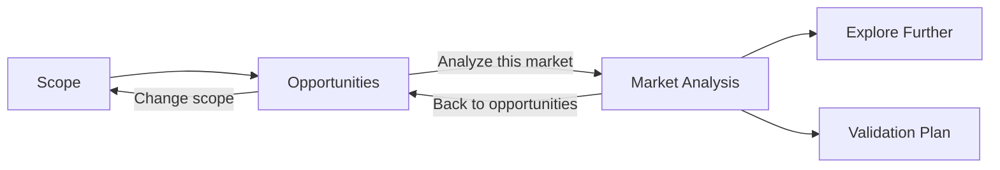

# Export Market Analysis 工作区 UI 设计规范

**Status:** Design complete  
**Designed:** 2026-07-21  
**Implements:** [Export Market Analysis workspace specification](./export-market-analysis-workspace.md)  
**Builds on:** [Public-data HS Tracker MVP specification](./public-data-hs-tracker-mvp.md)  
**Architecture decision:** [Compose product-level Market Analysis above existing analysis recipes](../adr/0005-compose-product-market-analysis-above-analysis-recipes.md)  
**Primary implementation slices:** Slices 4–8 of the product specification

## 1. 文档目的

本文档定义 HS Tracker 作为一个完整 Export Market Workspace 的信息架构、页面层级、产品区域、交互状态、视觉语言、响应式行为和设计验收标准。

设计目标不是把分析师的 20 个问题逐一做成 UI 卡片。产品应通过稳定、可理解、可复用的能力帮助分析师回答这些问题：定义范围、发现机会、分析市场、审查证据、进入高级工具并形成商业验证计划。

分析师问题只用于需求覆盖和验收追踪。生产 UI 不显示 AQ ID，不提供 question catalog，不按问题路由，也不使用一个通用 Answer Card 渲染所有内容。

本文档不重新定义公式、Analysis Identity、Dataset Package、HTTP 错误或发布规则。若视觉设计与产品功能规格冲突，以产品功能规格为准。

### 1.1 UI 完成标准

- 首要路径是 Scope → Opportunities → Market Analysis，而不是选择 Analysis Recipe 或 analyst question；
- 一次范围选择可以连续进入机会发现和单一市场分析，无需重复输入；
- Market Analysis 使用 Market Snapshot、Demand、Exporter Position、Supplier Landscape、Evidence Quality、Recent Momentum、Explore Further 和 Validation Plan 八个稳定产品区域；
- 20 个 analyst needs 的 10 Direct / 5 Bounded / 5 Outside 覆盖通过浏览器和产品契约测试验证，但 AQ ID 不出现在生产 DOM、URL 或 JSON；
- 产品先给出解释，再展示验证证据、限制和 provenance；
- Market Analysis 不显示产品级总分、总置信度、概率或推荐状态；
- Candidate Market Score、Investigation Priority 和 Data Confidence 始终标明其既有证据所有者；
- Recent Trade Momentum 是独立、相邻的月度产品区域，不阻塞或改变年度分析；
- Validation Plan 清楚说明公共证据之外仍需完成的工作，不创建占位请求；
- 英文和简体中文具有相同的值、状态、操作和信息顺序；
- 从 320 CSS px 起可完成全旅程，不存在只能横向滚动才能理解的核心内容；
- 键盘、屏幕阅读器、200% zoom、reduced motion、dark theme 和 high contrast 均可完成同一旅程；
- Canonical Task Link 的复制、重载、后退、前进、Current、Retained 和退休恢复保持成立；
- 所有图形具有相同范围的数据表或文本等价物；
- React 不重新计算 Candidate Market Score、CAGR、supplier share、HHI 或 momentum threshold。

## 2. 产品设计原则

### 2.1 产品区域，而不是问题清单

用户进入产品是为了完成市场分析，不是逐项回答问卷。界面应呈现一个连贯的工作对象：

```text
Export Market Workspace
├── Scope
├── Opportunities
└── Market Analysis
    ├── Market Snapshot
    ├── Demand
    ├── Exporter Position
    ├── Supplier Landscape
    ├── Evidence Quality
    ├── Recent Momentum
    ├── Explore Further
    └── Validation Plan
```

每个产品区域有自己的信息形态。Demand 使用趋势与摘要；Supplier Landscape 使用份额结构和完整表格；Evidence Quality 使用质量台账。不得把这些差异压平成 20 张结构相同的卡片。

### 2.2 解释优先，审计按需展开

每个分析区域先显示一条由 typed evidence 决定的解释，再显示关键值、图形或结构，最后提供完整表格和 provenance。

公式、长 identity、完整 cohort 和技术元数据可展开，但 period、unit、comparison basis、missingness 和 limitation 不能只藏在 disclosure 或 tooltip 中。

### 2.3 证据状态是产品语义

产品必须区分：

- recorded positive evidence；
- no recorded positive flow；
- missing observation；
- unavailable summary；
- bounded product capability；
- outside current public evidence；
- route/loading failure。

这些状态不能被一个通用 `ANSWERED` / `NOT_PROVIDED` 状态机覆盖。每个产品区域使用其数据类型拥有的状态，并提供可读解释。

### 2.4 不可覆盖的商业证据形成 Validation Plan

当前产品不能覆盖的商业工作不应被伪装成空问题卡片。Validation Plan 将其组织成五类后续工作：

1. Quantity and customs unit value；
2. Market access and regulation；
3. Logistics and landed cost；
4. Companies and commercial relationships；
5. Company economics, risk, and forecasting。

每类显示已知边界、所需证据、能力处置和下一步，不显示 Coming Soon 或假估算。

### 2.5 固定上下文比界面便利更重要

范围、市场、部署状态、年度窗口和来源新鲜度在工作流中持续可见。任何范围变更都必须显式发生，并清除不兼容的旧结果。产品不得静默用 Current evidence 替换 Retained 或 retired link 的证据。

### 2.6 月度和年度证据保持视觉及行为隔离

Recent Momentum 使用独立边界、独立 loading、独立 provenance 和独立 retry。它可以补充分析，但不能改变年度分析、Candidate Market Score、Investigation Priority、rank 或 Data Confidence。

## 3. 现有界面迁移

### 3.1 保留与重用

| 现有能力 | 新产品角色 | 设计要求 |
|---|---|---|
| `EconomyCombobox` | Scope 的 export economy 选择 | 保留搜索、键盘、恢复和 retired handling |
| `ProductCombobox` | exact HS Product confirmation | 精确结果即确认；显示 revision、code 和双语描述 |
| `trade-analysis-context.ts` | Canonical Task Link 唯一 seam | 新组件不得手写 query string 或复制 pin 规则 |
| `SourceScope` 数据 | persistent Scope Bar + source disclosure | 摘要紧凑，完整来源仍可审查 |
| `AnalysisShareLink` | Copy Market Analysis link | 根据当前产品状态提供明确文案 |
| theme、locale、skip link | product shell | 保留 pre-paint、URL locale 和 focus 行为 |
| Candidate Market complete cohort/virtualization | fixed-product Opportunities | 保留 canonical ordering |
| Opportunity Discovery pagination | cross-product/portfolio Opportunities | 保留稳定 cursor 和 complete-row semantics |
| Trade Trend、Supplier Competition、Trade Explorer | Explore Further | 保留 direct address、audit 和 export |

### 3.2 替换或降级

| 现有界面 | 产品决定 |
|---|---|
| 超大营销 Hero | 未定义范围时只保留紧凑产品价值说明 |
| `Choose an analysis task` 五任务网格 | 从 primary information architecture 移除 |
| Candidate Market master-detail audit panel | 替换为 Opportunities 列表和全宽 Market Analysis |
| Opportunity Discovery 选中行自动加载长详情 | 行只用于扫描；显式 **Analyze this market** 才进入分析 |
| Candidate Market comparison tray | 不进入本轮 primary path；旧能力仅做兼容 |
| 多个 recipe 主按钮 | 收纳为 Explore Further secondary actions |
| 登录后 Account Workspace 替换公共分析 | 登录只增加 portfolio input，不改变产品主线 |
| Question catalog / generic Answer Card | 不实现；用稳定产品区域和专用视图替代 |

## 4. 信息架构

### 4.1 产品旅程



Journey Indicator 显示三个主要阶段：

1. **Scope / 定义范围**
2. **Opportunities / 发现机会**
3. **Market Analysis / 市场分析**

Explore Further 和 Validation Plan 是 Market Analysis 的后续区域，不创建额外步骤或 recipe。

### 4.2 全局壳层

从上到下包含：

1. **App Header** — brand、public/signed-in state、Advanced Tools、theme、language、account；
2. **Workspace Scope Bar** — exporter、product scope、selected market、deployment、period、freshness；
3. **Journey Indicator**；
4. **Page Content** — Scope、Opportunities 或 Market Analysis；
5. **Footer** — public evidence boundary 和 source access。

工作区激活后不再重复营销 Hero、账户大面板或 recipe task cards。

### 4.3 Advanced Tools

App Header 提供 secondary **Advanced tools / 高级工具** menu：

- Trade Trend；
- Supplier Competition；
- Trade Explorer。

这些入口不使用 primary CTA 权重。Market Analysis 的 Explore Further 区域提供携带相同 semantic context 的链接。旧 recipe URL 和 CSV export 继续可达。

### 4.4 URL 与浏览器历史

- fixed-product row 的 **Analyze this market** 设置 focused market 并 `pushState` 一个 canonical Candidate Market entry；
- cross-product/portfolio row 同时写入该行精确 HS Product 和 market；
- Market Analysis 不引入新的 browser `recipe=` value；
- section navigation 只控制页面位置，不进入 Analysis Identity；
- **Back to opportunities** 优先恢复 history 中的 scope、已加载页数、列表位置和 focus；
- direct/reloaded/new-window Market Analysis 没有站内 history 时，Back action 使用当前 exporter/product 生成 canonical Opportunities link，不调用 `history.back()` 离开应用；
- locale 只改变 presentation，不重新执行分析；
- theme、disclosure 和 active section 不写入 canonical URL；
- Retained 始终显示 Retained；retired context 只能通过 Explicit Current Refresh 产生新 link。

## 5. 页面状态模型

| 页面状态 | 进入条件 | 主内容 | 操作 |
|---|---|---|---|
| Unscoped | 无有效 exporter | Scope | Confirm scope and discover |
| Scope ready | 必要 input 已确认 | scope summary + evidence boundary | Discover opportunities |
| Opportunities loading | scope 已提交 | persistent Scope Bar + stable skeleton | Change scope |
| Opportunities ready | ordered rows 返回 | summary + canonical rows | Analyze this market |
| Opportunities empty | valid scope 无 eligible rows | explicit valid-empty state | Change scope |
| Market Analysis loading | exact Candidate Market Context 已确定 | heading + atomic annual skeleton | Back |
| Market Analysis ready | 三个 annual constituents 一致 | 八个产品区域 | Explore / copy / back |
| Market Analysis failed | 任一 annual constituent failure | one complete error state | Retry / refresh / back |
| Recent Momentum loading | annual view 已可交互 | only Recent Momentum skeleton | Continue reading |
| Recent Momentum failed | annual view 保持可读 | local bounded/temporary state | Retry monthly evidence |
| Retired | pin 不可服务 | preserved context + retired explanation | Explicit Current Refresh |

切换 scope 或 market 时，不得把旧分析放在新标题下。取消后的 stale response 不得写入页面。

## 6. Scope 设计

### 6.1 未定义范围页面

```text
┌─────────────────────────────────────────────────────────────────────┐
│ Analyze export markets with reproducible public trade evidence.     │
│ Define the exporter and choose how broadly to discover markets.     │
├───────────────────────────────────┬─────────────────────────────────┤
│ Export economy                    │ Product evidence boundary       │
│ [ Search economy…              ]  │ • Discovery, not recommendation│
│                                   │ • Nominal current USD           │
│ Product scope                     │ • No company records            │
│ (•) Across published products     │ • Commercial validation needed  │
│ ( ) One confirmed HS Product      │                                 │
│ ( ) My confirmed portfolio        │                                 │
│                                   │                                 │
│ [ Discover opportunities → ]      │                                 │
└───────────────────────────────────┴─────────────────────────────────┘
```

页面首屏描述产品可以做什么，不列出 20 个 questions，也不要求用户选择 tool/recipe。

### 6.2 Product scope modes

| Mode | Available to | Destination | Meaning |
|---|---|---|---|
| Across published products | all users | Opportunity Discovery | discover cross-product product-market rows |
| One confirmed HS Product | all users | Candidate Markets | analyze one exact HS12 product cohort |
| My confirmed portfolio | signed-in users with confirmed products | portfolio-projected Opportunities | portfolio filters inputs only |

Anonymous users do not see a disabled portfolio option; a sign-in link appears as supporting text. Signed-in users with an empty portfolio see **Set up portfolio / 设置产品组合** and do not generate an empty analytical request.

### 6.3 Exact product confirmation

Search text is not an analytical input. Only selecting an exact Product Catalog result produces a confirmed block with:

- HS 2012；
- six-digit code；
- English description；
- Simplified Chinese description；
- **Change product / 更改产品**。

The product always states that HS12 search/confirmation is supported while SKU classification and HS17/HS22 conversion are not.

### 6.4 Primary action

- Across products: **Discover product-market opportunities / 发现产品—市场机会**；
- One product: **Discover Candidate Markets / 发现候选市场**；
- Portfolio: **Discover portfolio opportunities / 发现产品组合机会**。

CTA is enabled only when required scope is confirmed. A disabled state has a visible explanation and is not conveyed by opacity alone.

## 7. Workspace Scope Bar

### 7.1 Desktop summary

```text
┌──────────────────────────────────────────────────────────────────────────┐
│ China (156) · HS12 010121 Horses… → Netherlands (528)                   │
│ Current · BACI V202601 · Finalized 2019–2023 · Provisional 2024 · Fresh │
│                         [Change scope] [Copy link] [Source details]        │
└──────────────────────────────────────────────────────────────────────────┘
```

In Opportunities, market is omitted. Broad/portfolio scopes show their scope label until a row establishes one exact product for Market Analysis.

### 7.2 Deployment and source state

Use separate text fields for:

- Current / 当前；
- Retained / 保留版本；
- Retired / 已停用；
- Last Verified Resident Fallback / 最后验证的驻留回退；
- Source Freshness Status。

Deployment Activation Mode and Source Freshness Status must not collapse into one green/red indicator.

### 7.3 Mobile behavior

Below 620px, show one-line identity plus **View scope / 查看范围**. Expanded order:

1. exporter；
2. exact product/scope；
3. market；
4. deployment state；
5. Finalized/Provisional period；
6. Source Freshness；
7. Change scope、Copy link、Source details。

Retired or source-warning states remain visible when collapsed.

## 8. Opportunities 设计

### 8.1 Page hierarchy

1. page title and scope；
2. product summary；
3. canonical ordering explanation；
4. ordered opportunity rows；
5. pagination/complete-cohort state；
6. CSV export and discovery disclaimer。

The summary states what cohort is available and how it is ordered. It never says best, recommended, untapped, or likely to succeed.

### 8.2 Fixed-product row

```text
┌─────────────────────────────────────────────────────────────────────────┐
│ #04  Netherlands                                      High confidence   │
│ Candidate Market Score 78 · Rank 4 of 108                               │
│ Size USD 2.4B/yr · Growth 8.2% · Foothold 12.3% · Diversity 0.71        │
│ [Monthly · adjacent: Accelerating]           [Analyze this market →]     │
└─────────────────────────────────────────────────────────────────────────┘
```

Requirements:

- Market is primary identity; product remains in Scope Bar；
- score/rank use the full Candidate Market Score name；
- two to four ordering components are visible；
- Data Confidence remains separate from score；
- monthly signal, when already present, says adjacent；
- one primary action only；
- no circular score gauge or red/green market traffic light；
- no presentation sort may masquerade as canonical rank。

### 8.3 Cross-product/portfolio row

```text
┌─────────────────────────────────────────────────────────────────────────┐
│ HS12 010121 · Horses…                         Netherlands                │
│ Investigation Priority 84 · Unvalidated Market Gap                      │
│ Market Attractiveness 90 · Exporter Fit 77 · Confidence High            │
│ [Monthly · adjacent: Coverage limited]       [Analyze this market →]     │
└─────────────────────────────────────────────────────────────────────────┘
```

Product and market have equal identity weight. Opportunity type is described as public evidence requiring validation. The action writes the row's exact product and market into Candidate Market Context.

### 8.4 List behavior

- Fixed-product cohort preserves complete canonical order and existing virtualization threshold；
- cross-product feed preserves cursor order and **Load more**；
- loading more preserves current rows and scroll position；
- no arbitrary sorting, score weights, or comparison tray in the primary path；
- CSV exports complete underlying results, not viewport rows。

### 8.5 Empty state

A valid scope with no eligible rows shows:

- no eligible Candidate Markets/opportunities；
- applicable Finalized window；
- explicit valid-empty evidence semantics；
- **Change scope**；
- no zero chart, zero rank, or retry-later language。

## 9. Market Analysis 设计

### 9.1 Entry

Only explicit **Analyze this market** opens Market Analysis. It:

- updates canonical Candidate Market Context and history；
- focuses the Market Analysis heading；
- loads annual product data atomically；
- removes previous market content before displaying the new identity；
- starts Recent Momentum only after annual content is interactive；
- preserves a usable Back action。

### 9.2 Desktop layout

```text
┌──────────────────────────────── Scope Bar ────────────────────────────────┐
│ [← Back to opportunities]                                                │
│ Netherlands · Market Analysis                         [Copy link]         │
│ HS12 010121 · China → Netherlands · Current · 2019–2023                  │
├───────────────┬───────────────────────────────────────────────────────────┤
│ Section nav   │ MARKET SNAPSHOT                                           │
│ • Snapshot    │ Why this market appears · score/rank/confidence           │
│ • Demand      ├───────────────────────────────────────────────────────────┤
│ • Position    │ DEMAND                                                    │
│ • Suppliers   │ scale · finalized trend · change · provisional context    │
│ • Quality     ├───────────────────────────────────────────────────────────┤
│ • Momentum    │ EXPORTER POSITION                                         │
│ • Explore     │ score-window · pooled supplier · provisional bilateral    │
│ • Validate    ├───────────────────────────────────────────────────────────┤
│               │ SUPPLIER LANDSCAPE                                        │
│               │ complete shares · HHI · quality warnings                  │
│               ├───────────────────────────────────────────────────────────┤
│               │ EVIDENCE QUALITY                                          │
│               │ confidence · missingness · stability · revision · source  │
│               ├───────────────────────────────────────────────────────────┤
│               │ RECENT MOMENTUM — ADJACENT MONTHLY EVIDENCE               │
│               ├───────────────────────────────────────────────────────────┤
│               │ EXPLORE FURTHER                                           │
│               ├───────────────────────────────────────────────────────────┤
│               │ VALIDATION PLAN                                           │
└───────────────┴───────────────────────────────────────────────────────────┘
```

Main reading column is about 920px. At ≥1200px, section nav is 200–240px and sticky. It lists product areas, never analyst questions or recipes.

### 9.3 Header

Shows:

- Market name + **Market Analysis / 市场分析**；
- exporter, HS revision/code/bilingual description, market code；
- Current/Retained；
- Finalized window and Provisional Year；
- Copy Market Analysis link；
- Back to Opportunities。

There is no Market Analysis score, confidence total, recommendation badge, Go/No-go, or completion percentage.

## 10. Product-area specifications

### 10.1 Market Snapshot

Purpose: establish why the market appears in the selected opportunity set without making a recommendation.

Default content:

- deterministic summary of canonical standing；
- Candidate Market Score and rank, fully named；
- Data Confidence, clearly scoped to Candidate Market evidence；
- two to four component facts；
- cohort size and discovery disclaimer；
- score audit disclosure using existing constituent values。

The score formula is not the opening content and is never reimplemented in React.

### 10.2 Demand

Purpose: show recorded market scale and trajectory.

Content:

- mean recorded world imports over the score window；
- five Finalized Year observations；
- first/last positive observations, absolute change, percentage change, CAGR when available；
- clear nominal current-USD label；
- separate Provisional Year callout；
- equivalent data table；
- Trade Trend provenance and advanced link。

Missing observation is a gap. No recorded positive flow is not zero. Fewer than two positive endpoints produces unavailable summary, not 0% CAGR.

### 10.3 Exporter Position

Purpose: show the selected export economy's recorded position at three non-interchangeable bases.

Use separate metric groups for:

- score-window recorded foothold；
- five-year pooled supplier value/share and supplier rank/position；
- Provisional Year bilateral value/share。

Each group displays its own period and basis. Visual proximity must not imply values can be added or directly substituted.

If no recorded bilateral flow exists, state it explicitly without a zero-height chart.

### 10.4 Supplier Landscape

Purpose: show complete recorded origin structure and concentration.

Content:

- leading supplying economies as horizontal share bars；
- complete bounded cohort table；
- finalized pooled market value；
- HHI on exact 0–10,000 scale or exact unavailable reason；
- quality warnings；
- selected export economy highlight with text label；
- separate Provisional supplier snapshot；
- Supplier Competition provenance and advanced link。

Do not collapse the complete cohort into an unauditable Other category. Do not imply companies, brands, buyers, or ongoing commercial relationships.

### 10.5 Evidence Quality

Purpose: make uncertainty and reproducibility understandable without a fake health score.

Use an evidence ledger containing:

- Candidate Market Data Confidence and deductions；
- observed/missing Finalized Years；
- small base, instability, exceptional shock/discontinuity, and identity flags；
- quantity coverage, explicitly outside score；
- Release Revision；
- Source Freshness Status and deployment mode；
- annual shared period/unit；
- constituent Analysis Identities and Dataset Package identities。

A shared annual provenance mismatch is a fatal product loading failure, not low Data Confidence.

### 10.6 Recent Momentum

Purpose: add current monthly context where reviewed coverage exists.

The area:

- always renders；
- starts loading after annual Market Analysis is interactive；
- uses `--state-adjacent-*` tokens distinct from annual status colors；
- supports signal, supported-no-signal, not-observed, suppression/reallocation, unsupported market, unsupported product mapping, source unavailable, and temporary failure；
- offers local retry for temporary failure；
- shows reporter, mapping, currency, source vintage, cutoff, comparison months, coverage, confidence, reasons, Analysis Identity, and Dataset Package identity；
- states that monthly evidence does not change annual score, rank, evidence, or Data Confidence。

### 10.7 Explore Further

Purpose: give advanced analysts context-preserving access to existing tools without making tools the product's main structure.

| Tool | Product explanation | Context behavior |
|---|---|---|
| Trade Trend | Audit annual observations and export | retain market + product |
| Supplier Competition | Audit complete supplier structure and export | retain market + product |
| Trade Explorer | Inspect allowlisted bounded evidence shapes | prefill only safely transferable context |

For product mix, link copy says **Inspect bounded product-mix evidence**, not Find adjacent products. Current evidence does not define product adjacency.

### 10.8 Validation Plan

Purpose: identify commercial work required before a business decision.

Render five categories in fixed order:

1. Quantity and customs unit value；
2. Market access and regulation；
3. Logistics and landed cost；
4. Companies and commercial relationships；
5. Company economics, risk, and forecasting。

Each category contains:

- what public product evidence already establishes；
- what it cannot establish；
- required evidence category；
- candidate extension or intentional exclusion；
- one non-automated next step。

The forecasting category is **Intentional product exclusion**. Do not show provider logos, credentials, empty charts, disabled controls, notify-me controls, estimates, or requests.

## 11. Evidence states and failures

### 11.1 Product evidence states

Do not display a global Direct/Partial/Unavailable badge system. Use area-specific evidence language:

| Evidence meaning | Product presentation |
|---|---|
| recorded positive | value + period/basis + interpretation |
| no recorded positive flow | explicit neutral statement; no zero substitution |
| missing observation | visible gap + missing label |
| summary unavailable | exact reason from typed result |
| bounded capability | limitation text at point of use + safe next action |
| outside public evidence | Validation Plan category |
| request failure | recovery surface separate from evidence state |

Color and icon are redundant aids only.

### 11.2 Loading

- manifest、Opportunities、annual Market Analysis 和 Recent Momentum 使用不同状态文案；
- skeleton is `aria-hidden`, with a text `role="status"`；
- annual Market Analysis is one atomic skeleton/error state；
- Recent Momentum has a local polite status；
- skeleton reserves realistic space to reduce CLS；
- Scope Bar and Back remain available during loading。

### 11.3 Error behavior

| State | UI behavior | Action |
|---|---|---|
| Invalid/unknown identity | identify invalid scope; no stale result | Change scope |
| `CANDIDATE_MARKET_NOT_FOUND` | market absent from complete cohort | Back to opportunities |
| Retired build | show original pin and no silent update | Refresh with current evidence |
| Budget exceeded | explain complete result was not loaded | Narrow scope |
| Rate limited | preserve context and Retry-After | Retry |
| Capacity exceeded | complete result not loaded | Retry |
| Analysis unavailable/provenance mismatch | public compatible-evidence unavailable message; no private identities | Retry later / Back |
| Recent Momentum failure | annual view unchanged; local state | Retry monthly evidence |
| Internal error | correlation-safe generic message | Retry / Back |

Fatal annual failure uses assertive status. Evidence limitations do not use `role="alert"`.

### 11.4 Explicit Current Refresh

The retired recovery surface states:

- which requested build is retired；
- refresh creates a new Current Context and Analysis Identity；
- the original link is not silently rewritten。

Use **Refresh with current evidence / 使用当前证据刷新**, not ambiguous Refresh.

## 12. Provenance

Every analytical product area provides **Evidence & provenance / 证据与溯源**. Collapsed state still shows period, unit, comparison basis, and owning recipe. Expanded state shows:

- Analysis Recipe version；
- Analysis Identity；
- Dataset Package identity；
- BACI Release or monthly source vintage；
- analysis build；
- Finalized/Provisional or monthly period；
- value unit/currency；
- calculation owner；
- scoped warning/coverage reason；
- advanced evidence link where relevant。

Long identities use monospace and wrapping, never ellipsis-only or tooltip-only display. Global Source Details does not replace constituent provenance.

## 13. Visualization

### 13.1 General rules

- visualization for comprehension, table for audit；
- legend states unit、currency、period、measure basis；
- missing remains a gap；
- Provisional is separate；
- percentile bars say cohort percentile, not probability；
- no count-up animation；
- color never solely conveys increase/decrease/confidence/availability。

### 13.2 Demand trend

Finalized observations form the only trend line. Provisional evidence appears below as a labelled callout/table row and never connects to the line. Missing years remain gaps with text labels.

### 13.3 Supplier shares

Leading shares may use horizontal bars, but the complete bounded cohort remains accessible in the same loaded result. HHI shows exact scale and explanation. Selected exporter uses outline/marker plus text, not color alone.

### 13.4 Evidence Quality

Use a ledger, not gauge or single health score. Confidence deductions, missingness, stability, quantity coverage, revision and provenance retain separate ownership.

## 14. Responsive layout

Use existing 900px and 620px breakpoints, with wide navigation at 1200px.

| Viewport | Layout |
|---|---|
| ≥1200px | max 1440–1520px shell; sticky area nav + ~920px reading column |
| 901–1199px | one main column; wrapped horizontal area links |
| 621–900px | one column; rows use two-layer grid; charts/tables stack |
| 320–620px | compact header; expandable Scope Bar; vertical jump list; card-like opportunity rows |

At 621–1199px, area links wrap without horizontal scrolling. At 320–620px, use a native disclosure with **Jump to section / 跳转到章节** and ordered single-column links. Current area uses `aria-current="location"` plus visible text/border.

### 14.1 Mobile reading order

1. Scope；
2. Market Snapshot；
3. Demand；
4. Exporter Position；
5. Supplier Landscape；
6. Evidence Quality；
7. Recent Momentum；
8. Explore Further；
9. Validation Plan。

### 14.2 Table adaptation

- small key-value tables become definition lists；
- annual/supplier tables can become row records；
- horizontal table, if retained, must have a non-horizontal summary；
- sticky columns must not cover focus；
- complete supplier cohort remains accessible。

## 15. Visual language

### 15.1 Direction

The visual direction is a calm evidence workspace, not a sales dashboard:

- retain existing deep green, paper, and orange brand system；
- use light evidence surfaces for primary reading；
- reserve dark feature panel for Market Snapshot or compact source scope；
- reduce large gradients, circular gauges, badge density, and continuous animation；
- use typography, spacing and boundaries to express evidence hierarchy。

### 15.2 Existing tokens

| Meaning | Token/use |
|---|---|
| primary text | `--ink`, `--ink-deep` |
| secondary text | `--muted`, `--ink-soft` |
| surfaces | `--paper`, `--card`, `--paper-light` |
| CTA/focus | `--accent`, `--accent-strong`, `--focus`, `--ring` |
| recorded evidence | `--signal-text` + tint, always with text |
| fatal/recovery | error semantic boundary, distinct from bounded evidence |
| feature panel | `--panel-a`, `--panel-b`, `--on-panel` |

### 15.3 New semantic tokens

Add coordinated light/dark/no-JS-dark values:

- `--evidence-recorded-fg/bg/border`；
- `--evidence-no-flow-fg/bg/border`；
- `--evidence-missing-fg/bg/border`；
- `--evidence-bounded-fg/bg/border`；
- `--state-adjacent-fg/bg/border`；
- `--state-error-fg/bg/border`；
- `--font-mono`。

Do not reuse accent for CTA, fatal error, and bounded evidence. All combinations meet WCAG AA; structure and text remain redundant signals.

### 15.4 Typography and spacing

- display serif only for page, Market Analysis, and area titles；
- UI sans for controls, body, labels and tables；
- tabular numerals for data；
- monospace for identities/codes；
- unscoped title around `clamp(2.5rem, 5vw, 4.5rem)`；
- Market Analysis title around `clamp(2.25rem, 4vw, 3.75rem)`；
- body line-height 1.55–1.7；
- 4px rhythm: 4, 8, 12, 16, 24, 32, 48, 64。

### 15.5 Motion

- hover/focus 120–200ms；
- smooth section scroll only when motion allowed；
- no rank/score/growth/share count animation；
- no large slide transition that masks evidence change；
- all effects suppressed under `prefers-reduced-motion`。

## 16. Focus、keyboard 和 browser behavior

- first skip link targets current workspace content；
- Scope order: label → input → result list → confirmed selection → CTA；
- opportunity action accessible name includes market and, for cross-product rows, HS Product；
- explicit Analyze moves focus to Market Analysis heading；
- background refresh, locale, theme, and Recent Momentum completion do not move focus；
- area navigation uses normal anchors/controls and does not intercept Page Up/Down；
- Back restores list position and focus to originating Analyze action；
- disclosures use native `<details>` or `button + aria-expanded + aria-controls`；
- touch targets at least 44×44 CSS px；
- sticky elements do not cover focused content；
- virtualized selected/focused row remains in accessibility tree。

## 17. Bilingual content

### 17.1 Canonical terms

| English | 简体中文 |
|---|---|
| Export Market Workspace | 出口市场工作区 |
| Opportunities | 市场机会 |
| Market Analysis | 市场分析 |
| Market Snapshot | 市场概览 |
| Demand | 市场需求证据 |
| Exporter Position | 出口方位置 |
| Supplier Landscape | 供应方格局 |
| Evidence Quality | 证据质量 |
| Recent Momentum | 近期动量 |
| Explore Further | 深入探索 |
| Validation Plan | 商业验证计划 |
| Candidate Market | 候选市场 |
| Candidate Market Score | 候选市场评分 |
| Investigation Priority | 调查优先级 |
| Data Confidence | 数据置信度 |
| Finalized Year | 定稿年份 |
| Provisional Year | 暂定年份 |
| No recorded positive flow | 未记录到正向流量 |
| Missing observation | 观测缺失 |

Do not translate Candidate Market as 推荐市场, Customs Unit Value as transaction price, or market imports as addressable demand.

### 17.2 Deterministic interpretation examples

- Demand: “Recorded imports increased from {first positive Finalized Year} to {last positive Finalized Year}; the five-year summary CAGR is {value}.”
- Exporter Position: “The selected export economy supplied {share} of pooled recorded imports and ranked {rank} among recorded supplying economies.”
- No flow: “No positive bilateral flow from {export economy} was recorded in the {window} Finalized Years.”
- Recent Momentum bound: “Recent momentum is unavailable because this market is outside reviewed reporting-market coverage; annual evidence is unchanged.”

Values come only from typed outcomes. Copy must not infer causation or recommendation.

### 17.3 Prohibited language

Unless explicitly negating a misconception, do not use:

- best market / 最佳市场；
- untapped market / 未开发市场；
- real demand / 真实需求；
- customer / 客户；
- expected sales / 预期销售；
- recommended entry / 建议进入；
- success probability / 成功概率；
- low risk / 低风险。

## 18. Suggested presentation Modules

```text
ExportMarketWorkspace
├── WorkspaceHeader
├── WorkspaceScopeBar
│   └── SourceDetailsDisclosure
├── JourneyIndicator
├── ScopeDefinition
│   ├── EconomyCombobox
│   ├── ProductScopeSelector
│   └── ProductCombobox
├── OpportunitiesView
│   ├── OpportunitiesSummary
│   ├── FixedProductOpportunityRow | CrossProductOpportunityRow
│   └── OpportunitiesExportAndBoundary
└── MarketAnalysisView
    ├── MarketAnalysisHeader
    ├── ProductAreaNavigation
    ├── MarketSnapshot
    ├── DemandPanel
    ├── ExporterPositionPanel
    ├── SupplierLandscapePanel
    ├── EvidenceQualityPanel
    ├── RecentMomentumPanel
    ├── ExploreFurtherPanel
    └── ValidationPlan
```

These are presentation Modules with capability-specific interfaces. Do not add `AnalystAnswerCard`, one fetch owner per question, a generic panel registry, or AQ-based branching.

### 18.1 File-level migration

| File | Direction |
|---|---|
| `src/app/page.tsx` | compact product entry; anonymous and signed-in share one product shell |
| `src/app/analysis-task-home.tsx` | remove from primary path; retain only compatibility until migration proven |
| `src/app/discovery-workspace.tsx` | retain scope/context/cohort/virtualization; replace audit detail with Market Analysis transition |
| `src/app/opportunity-discovery-workspace.tsx` | retain feed/pagination; replace auto detail with Analyze action |
| `src/app/candidate-market-evidence.tsx` | cease as default detail; reuse safe formatters/audit presentation only |
| `src/app/source-scope.tsx` | split compact Scope Bar summary from full disclosure |
| `src/app/trade-analysis-context.ts` | remain sole browser URL seam; no Market Analysis recipe |
| `src/app/globals.css` | add evidence-state tokens and product layouts without unrelated legacy reformatting |

## 19. Design acceptance matrix

### 19.1 Core journeys

1. China + HS12 `010121` → Candidate Markets → Netherlands Market Analysis；
2. cross-product row → same exact Candidate Market Context；
3. signed-in portfolio row → byte-identical public analysis；
4. Back/Forward restores opportunities and analysis；
5. copy/reload/new-window reproduces pin, market and locale；
6. Retained remains Retained; retired never silently loads Current；
7. non-EU market shows Recent Momentum coverage state without annual change；
8. low-confidence market shows ranking evidence and Evidence Quality separately；
9. supplier-empty result shows valid empty supplier evidence, not route error；
10. Validation Plan shows all five work categories with no request placeholder。

### 19.2 Analyst-needs traceability

Acceptance tests reference AQ-01–AQ-20 only as test metadata. They verify that the product area provides the documented evidence or limitation. Production DOM snapshots assert that AQ identifiers, question catalog controls, and question-based navigation are absent.

### 19.3 Visual states

Verify both locales, themes and target viewports for:

- recorded evidence；
- no recorded positive flow；
- missing observation；
- summary unavailable；
- bounded capability；
- Validation Plan outside-evidence category；
- annual loading/failure；
- monthly loading/failure；
- empty cohort；
- retired build；
- rate/capacity/unavailable；
- long names and identities。

Viewports: 1440×900、1024×768、768×1024、390×844、320×568。

### 19.4 Accessibility

- heading outline matches visual order；
- area nav, rows, disclosures and recovery actions keyboard accessible；
- focus entry/return works；
- decolorized states remain distinct；
- charts have same-scope tables；
- live regions do not repeat the full analysis；
- 200% zoom preserves content；
- reduced motion suppresses scrolling/data animation；
- both locales have complete accessible names；
- targets at least 44×44。

### 19.5 Product and architecture

- production JSON/DOM contains no AQ IDs, `questionAnswers`, question catalog, or generic question dispatcher；
- Market Analysis has no score/confidence/probability/recommendation/composite identity；
- Recent Momentum data/state remains outside annual result；
- Validation Plan categories have no executable evidence handler；
- locale switch does not make an analytical request；
- UI contains no formula copy；
- advanced links preserve safe context；
- legacy links and exports remain working。

## 20. Explicitly rejected patterns

- recipe card grid as primary navigation；
- analyst question list as product navigation；
- runtime question catalog or AQ IDs in public results；
- generic Answer Card for every capability；
- mandatory wizard/checklist；
- product-level score/confidence/probability/recommendation；
- circular gauges, red/green market traffic lights, celebration animation；
- hidden evidence gaps；
- one request/handler per question；
- generated-only conclusions；
- arbitrary sort/weight/formula controls；
- missing displayed as zero；
- partial annual view after constituent failure；
- monthly evidence in annual ETag/failure state；
- Market Analysis export route；
- Coming Soon/provider/credential placeholders；
- silent Current Refresh；
- mobile core content requiring horizontal-only comprehension；
- public buyer/company/brand/relationship claims。

## 21. Definition of Done

1. Scope → Opportunities → Market Analysis replaces the task-first primary experience；
2. Market Analysis uses stable product areas and no question runtime machinery；
3. 20 analyst needs and 10/5/5 coverage pass as acceptance traceability, not UI structure；
4. typed evidence states remain distinct and understandable；
5. interpretation、evidence、limitation、next action 和 provenance hierarchy passes both locales；
6. annual Market Analysis loads atomically and Recent Momentum independently；
7. Current/Retained/retired/back/forward/copy/reload pass；
8. Advanced Tools and exports remain reachable but secondary；
9. desktop/tablet/mobile/light/dark/high-contrast/reduced-motion/keyboard journeys pass；
10. implementation matches product specification, domain language, and no-new-formula boundary。
