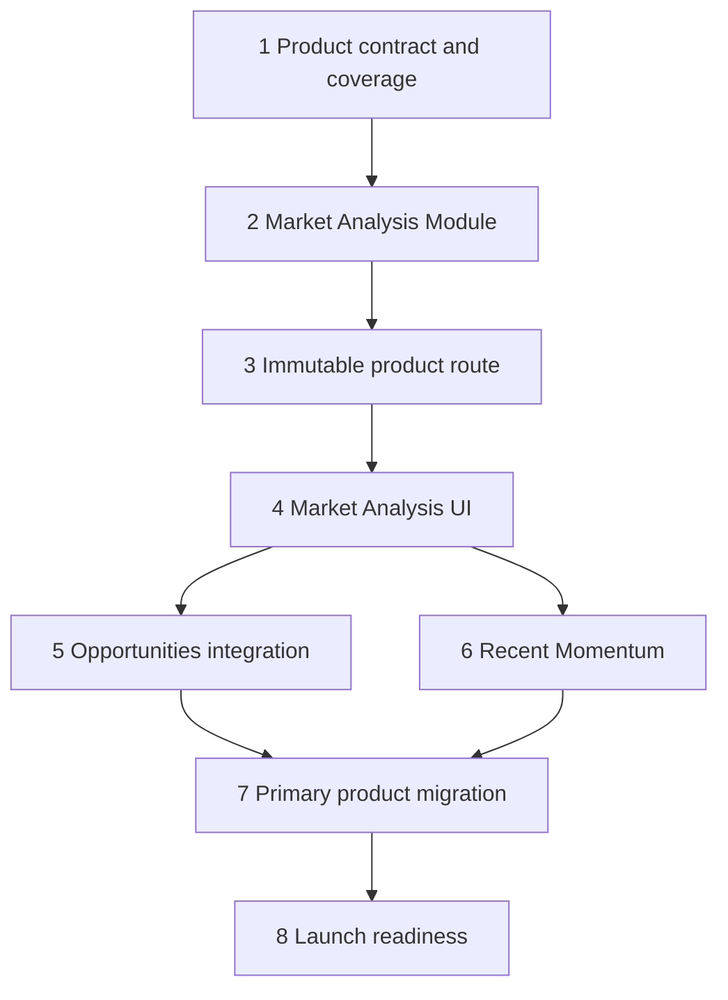

# Export Market Analysis workspace specification

**Status:** Decision complete  
**Specified:** 2026-07-21  
**Builds on:** [Public-data HS Tracker MVP specification](./public-data-hs-tracker-mvp.md)  
**Architecture decision:** [Compose product-level Market Analysis above existing analysis recipes](../adr/0005-compose-product-market-analysis-above-analysis-recipes.md)  
**Delivery tracking:** GitHub Epic [#64](https://github.com/huangyingting/HSTracker/issues/64) and its eight native child issues

## 1. Outcome

Refactor HS Tracker from a set of separately selected analytical tasks into one coherent **Export Market Workspace**.

An Export Market Analyst can:

1. establish one export economy and either one confirmed HS Product or a confirmed product portfolio;
2. discover Candidate Markets and product-market combinations worth deeper investigation;
3. open one product-level **Market Analysis** without re-entering context;
4. understand market scale and trajectory, the export economy's recorded position, supplying-economy structure, and evidence quality in one coherent view;
5. inspect separately identified Recent Trade Momentum when that adjacent monthly capability is available;
6. continue into bounded advanced evidence and a commercial Validation Plan; and
7. inspect period, source, Analysis Identity, Dataset Package identity, calculation ownership, confidence, and coverage limitations for every analytical value.

The product must provide enough evidence to answer the analyst needs in Section 3, but those questions do not define the production architecture. They are requirements and acceptance probes. They are not runtime objects, route parameters, result fields, navigation items, or generic UI cards.

The refactor does not replace or recalculate any existing score. A Candidate Market remains evidence for further investigation, not a prediction of sales, profit, market access, or commercial success.

### 1.1 Completion measures

The implementation is complete only when:

- the primary public experience is Scope → Opportunities → Market Analysis, not a recipe chooser or question catalog;
- the product capabilities in Section 2 cover the 20 analyst needs in Section 3 with exactly 10 supported directly, 5 supported with a declared bound, and 5 outside current product evidence;
- the coverage matrix is traceability documentation and test input only; no AQ identifier or question catalog is shipped in production JSON or used to dispatch behavior;
- every directly supported need can be satisfied in the product without spreadsheet calculation or a second manual query;
- every bounded capability states its exact geographic, temporal, semantic, or presentation limitation at the point of use;
- every evidence gap in the Validation Plan states the required evidence category and never triggers a placeholder request;
- one Candidate Market Context produces one coherent annual Market Analysis with no cross-release or cross-window mixing;
- Recent Trade Momentum remains visibly adjacent and never changes annual evidence, Candidate Market Score, Investigation Priority, rank, or Data Confidence;
- the existing Canonical Task Link continues to reproduce the selected Candidate Market Context;
- all existing advanced workspaces and CSV exports remain backward compatible; and
- English and Simplified Chinese journeys meet the same behavioral contract.

## 2. Product model

### 2.1 Product structure

The Export Market Workspace has four product stages:

1. **Scope** — establish the export economy and product scope.
2. **Opportunities** — discover and rank Candidate Markets or product-market combinations.
3. **Market Analysis** — inspect one selected market through stable product capabilities.
4. **Next Steps** — continue into advanced public evidence and a commercial Validation Plan.

The Market Analysis contains these stable product areas:

- **Market Snapshot** — why this Candidate Market appears in the selected opportunity set, including canonical score or ordering evidence owned by the existing recipe;
- **Demand** — recorded market scale, annual observations, change summary, and separately labelled Provisional Year context;
- **Exporter Position** — recorded foothold over the score window, pooled supplying-economy position, and Provisional Year bilateral evidence;
- **Supplier Landscape** — complete bounded supplying-economy shares, concentration, and quality warnings;
- **Evidence Quality** — Data Confidence, missingness, stability, caveats, quantity coverage, Release Revision, freshness, and constituent provenance;
- **Recent Momentum** — separately loaded adjacent monthly evidence with its own identity and coverage;
- **Explore Further** — context-preserving access to Trade Trend, Supplier Competition, and bounded Trade Explorer shapes; and
- **Validation Plan** — product-level categories of commercial evidence still required outside the current public evidence plane.

These areas are product capabilities, not one-to-one wrappers around analyst questions or Analysis Recipes.

### 2.2 Product capabilities hide analytical coordination

Users should not need to know which Analysis Recipe produced a visible value. Recipe ownership remains visible in provenance and advanced audit views, but recipe names are not the product's primary navigation.

`MarketAnalysis` is a deep Module above `TradeAnalyticsPlatform`. It hides:

- execution of the annual constituent recipes;
- selected Candidate Market projection;
- reconciliation of shared annual provenance;
- mapping constituent results into stable product areas;
- selection of the export economy from the supplying-economy cohort; and
- deterministic failure precedence.

The Module does not hide or merge constituent identities. It creates no composite Analysis Identity.

### 2.3 Analyst questions are acceptance probes

The 20 analyst questions in Section 3 serve three purposes only:

- requirement discovery;
- coverage traceability; and
- acceptance testing of product capabilities.

They do not require:

- an `analyst-question-catalog` production module;
- an `AnalystQuestionId` field in public results;
- `questionAnswers` in `MarketAnalysisV1`;
- a generic `answer(questionId, input)` interface;
- one handler, Module, route, or Adapter per question; or
- question headings as the UI information architecture.

Tests may use AQ identifiers as scenario names and traceability labels. Production code must not branch on them.

### 2.4 Deterministic product copy

Market Snapshot interpretations, evidence-quality explanations, coverage limits, Validation Plan descriptions, and next actions use version-controlled bilingual copy. Values come only from typed Analysis Outcomes.

Generative text may summarize an already-rendered Market Analysis in a future separate feature, but it must never calculate a value, infer missing evidence, change an evidence state, or become the only place provenance is visible.

### 2.5 Evidence gaps remain visible

The Validation Plan is a product feature, not a list of disabled questions. It groups missing commercial evidence into stable work categories:

- quantity and customs unit value;
- tariff and regulatory access;
- logistics and landed-cost assumptions;
- companies and commercial relationships; and
- company economics, risk, and forecasting.

Each category explains why current evidence is insufficient, what evidence is required, whether the capability is a candidate extension or an intentional exclusion, and the analyst's next non-automated step.

The product does not create speculative Modules or Adapters for these categories.

### 2.6 No product-level score or recommendation

A Market Analysis has:

- no score of its own;
- no aggregate confidence;
- no probability;
- no recommendation state;
- no new Analysis Recipe;
- no composite Analysis Identity; and
- no generated analytical value.

Candidate Market Score remains scoped to Candidate Market evidence. Investigation Priority remains scoped to Opportunity Discovery. Recent Trade Momentum confidence remains scoped to the monthly signal. Supplier Competition quality warnings remain scoped to that evidence.

## 3. Analyst-needs coverage matrix

### 3.1 Coverage vocabulary

The coverage classification is a specification and acceptance concept:

- **DIRECT** — the product presents the requested evidence from existing typed Analysis Outcomes without manual joining or calculation;
- **BOUNDED** — the product provides a clearly bounded proxy or a context-preserving advanced-evidence path, with the limitation visible; and
- **OUTSIDE** — the required source, measure, grain, or decision model is not present or is intentionally outside product scope.

Runtime evidence state is separate. A directly supported capability can truthfully show no recorded evidence. A bounded capability can be available for one market and unsupported for another. Neither is an application error.

### 3.2 Binding coverage

| Trace | Analyst need | Coverage | Product capability | Binding interpretation or limitation |
|---|---|---:|---|---|
| AQ-01 | Which HS code and revision correctly represent my product? | BOUNDED | Scope | Deterministic HS12 search and explicit confirmation are supported; SKU classification and HS17/HS22 conversion are not. |
| AQ-02 | Which economies import this HS Product, and how large is each market? | DIRECT | Opportunities, Demand | Present the complete eligible Candidate Market cohort and mean recorded world imports over the score window. |
| AQ-03 | Which markets are growing or declining, and what are the five-year rate and CAGR? | DIRECT | Opportunities, Demand | Clearly label nominal current-USD evidence; do not describe it as real demand growth. |
| AQ-04 | For one export economy and HS Product, which Candidate Markets warrant investigation first? | DIRECT | Opportunities, Market Snapshot | Present canonical rank, Candidate Market Score, components, and Data Confidence; do not call it a recommendation. |
| AQ-05 | Across products, which product-market combinations warrant investigation first? | DIRECT | Opportunities | Present Investigation Priority and its Market Attractiveness and Exporter Fit axes. |
| AQ-06 | Which attractive markets have weak or no recorded exporter foothold? | DIRECT | Opportunities, Exporter Position | Present Unvalidated Market Gap as a hypothesis requiring commercial validation. |
| AQ-07 | What recorded bilateral value and share does the selected export economy have in this market? | DIRECT | Exporter Position | Distinguish score-window share, pooled supplier value/share, and Provisional Year bilateral evidence. |
| AQ-08 | Are recent imports accelerating, stable, or weakening? | BOUNDED | Recent Momentum | EU-27 reporting markets and exact reviewed product mappings only; signal is market import momentum, not exporter-specific demand. |
| AQ-09 | Is apparent growth exposed to sparse years, small base, instability, exceptional shocks, or HS discontinuity? | BOUNDED | Evidence Quality | Present deductions and flags; do not claim causal attribution or separate price, exchange-rate, and volume effects. |
| AQ-10 | How current, complete, reproducible, and revision-sensitive is the evidence? | DIRECT | Evidence Quality | Present periods, missingness, freshness, Release Revision, identities, and quantity coverage. |
| AQ-11 | Which supplying economies serve this market, and what are their shares? | DIRECT | Supplier Landscape | Present the complete bounded supplying-economy cohort and five-year pooled values/shares. |
| AQ-12 | Is supply concentrated or diversified, and how dependent is the market on leading origins? | DIRECT | Supplier Landscape | Present HHI on the documented 0–10,000 scale together with supplier shares and warnings. |
| AQ-13 | What is the selected export economy's position relative to other supplying economies? | DIRECT | Exporter Position, Supplier Landscape | Compare economy-level pooled value and share; never imply company or brand position. |
| AQ-14 | Which competing economies are gaining or losing share over time? | BOUNDED | Explore Further | Current product has no year-by-supplier share-change result. Repeated single-year queries are evidence gathering, not a product answer. |
| AQ-15 | What are import quantity, customs unit value, price band, and the exporter's price position? | OUTSIDE | Validation Plan | Quantity coverage exists, but quantity and unit value are not public measures. Customs unit value must never be labelled transaction price. |
| AQ-16 | Which adjacent HS Products or product-mix shifts offer expansion evidence? | BOUNDED | Explore Further | Current evidence is a fixed exporter-importer-year bilateral product mix; no HS hierarchy, whole-market growth view, or adjacency method exists. |
| AQ-17 | What tariffs, preferences, trade remedies, non-tariff measures, certifications, and regulatory requirements apply? | OUTSIDE | Validation Plan | Requires reviewed policy and regulatory sources plus explicit HS-revision mapping decisions. |
| AQ-18 | What route, freight, insurance, transit-time, tax, and landed-cost economics apply? | OUTSIDE | Validation Plan | Requires logistics sources and company-specific cost assumptions; public trade value is not a landed-cost model. |
| AQ-19 | Which buyers, importers, distributors, or commercial relationships should be investigated? | OUTSIDE | Validation Plan | Requires separately sourced and access-controlled Company Trade Context; BACI contains no company or shipment parties. |
| AQ-20 | What sales, profit, success probability, or risk-adjusted entry recommendation should the business expect? | OUTSIDE | Validation Plan | Intentionally excluded without company capability, cost, channel, risk, calibration, and forecasting inputs. |

The matrix contains exactly 10 `DIRECT`, 5 `BOUNDED`, and 5 `OUTSIDE` needs. This count is verified in specification tests or release evidence, not by a production question catalog.

## 4. Product journey

### 4.1 Define Scope once

The analyst selects an export economy and one of these product scopes:

- all published HS Products for cross-product discovery;
- one exact confirmed HS Product; or
- a signed-in confirmed portfolio.

Selecting one exact Product Catalog result is the explicit confirmation step. Free text in the search field is never a confirmed HS Product. No extra confirmation checkbox or classification inference is introduced.

Operational portfolio state only supplies inputs. It never changes an Analysis Outcome or persists a copy of analytical facts.

The persistent Scope Bar shows:

- export economy;
- product scope and, when exact, HS revision, code, English description, and Simplified Chinese description;
- selected Candidate Market when in Market Analysis;
- Current, Retained, or retired deployment state;
- Finalized Year window and Provisional Year; and
- Source Freshness Status.

### 4.2 Discover Opportunities

The default product view uses Opportunity Discovery when no single product is selected and Candidate Markets when one product is selected.

The Opportunities view presents a product-level summary before the ordered rows. Each row shows:

- market identity;
- product identity where applicable;
- canonical rank or Investigation Priority;
- the two to four evidence components that own the ordering;
- Data Confidence or recipe-specific coverage state;
- Recent Trade Momentum only when already available and clearly marked as adjacent; and
- one primary action: **Analyze this market**.

The product never changes canonical ordering through presentation sorting, user-defined weights, or UI calculations.

### 4.3 Open one Market Analysis

Selecting **Analyze this market** establishes the existing Candidate Market Context and preserves the existing browser-facing Canonical Task Link:

```text
/?recipe=candidate-market-v1&exporter={code}&product={hs12}&market={code}&build={analysisBuildId}&pkg={candidateMarketDatasetPackageIdentity}&locale={locale}
```

No new browser recipe is introduced. The browser remains on that URL while it fetches the product data route in Section 6.

The Market Analysis renders product areas in this order:

1. Market Snapshot;
2. Demand;
3. Exporter Position;
4. Supplier Landscape;
5. Evidence Quality;
6. Recent Momentum;
7. Explore Further; and
8. Validation Plan.

Each analytical area begins with a deterministic interpretation and then exposes the evidence needed to verify it. Period, unit, comparison basis, recipe ownership, identities, and limitations remain visible or directly expandable.

### 4.4 Advanced evidence

Trade Trend, Supplier Competition, and Trade Explorer remain directly addressable for auditing and export. Market Analysis links to them with the same semantic context. They are advanced evidence tools, not alternative product conclusions.

### 4.5 Validation Plan

Validation Plan turns unsupported commercial evidence into actionable work categories. It does not make requests, display empty charts, offer disabled Coming Soon controls, collect credentials, or fabricate estimates.

## 5. Market Analysis Module

### 5.1 Seam and depth

`MarketAnalysis` is a deep Module above `TradeAnalyticsPlatform`. Its callers provide one Candidate Market Context and receive one coherent, product-shaped, identity-preserving annual evidence projection.

The Module hides recipe coordination, selected-row projection, annual-provenance reconciliation, product-area mapping, selected-exporter lookup in the supplier cohort, and deterministic failure precedence.

It does not add a new evidence-source seam. `TradeAnalyticsPlatform` already has fixture and immutable-production Adapters, so tests and production cross the same existing interface.

### 5.2 Interface

The implementation must expose an interface equivalent to:

```ts
export type MarketAnalysisRequest = Readonly<{
  analysisBuildId: string;
  exportEconomyCode: string;
  productCode: string;
  marketCode: string;
}>;

export interface MarketAnalysis {
  load(
    request: MarketAnalysisRequest,
    options?: AnalysisExecutionOptions,
  ): Promise<MarketAnalysisV1>;
}
```

`createMarketAnalysis(platform)` is the only production constructor.

Do not add per-recipe methods, question identifiers, storage parameters, SQL vocabulary, callback registries, a generic capability dispatcher, or optional future source ports.

### 5.3 Result contract

The result is a product composition, not an Analysis Outcome and not a question-answer record:

```ts
export type MarketAnalysisAnnualContext = Readonly<{
  baciRelease: string;
  hsRevision: "HS12";
  finalizedWindow: Readonly<{ start: number; end: number }>;
  provisionalYear: number;
  valueUnit: "CURRENT_USD";
}>;

export type MarketAnalysisV1 = Readonly<{
  schemaVersion: "market-analysis-v1";
  context: Readonly<{
    analysisBuildId: string;
    exporter: EconomyIdentity;
    product: ProductIdentity;
    market: EconomyIdentity;
  }>;
  annualContext: MarketAnalysisAnnualContext;
  constituentAnalyses: readonly Readonly<{
    recipe:
      | "candidate-market-v1"
      | "trade-trend-v1"
      | "supplier-competition-v1";
    analysisIdentity: AnalysisIdentity;
    datasetPackageIdentity: DatasetPackageIdentity;
  }>[];
  opportunity: MarketOpportunityEvidence;
  demand: MarketDemandEvidence;
  exporterPosition: ExporterPositionEvidence;
  supplierLandscape: SupplierLandscapeEvidence;
  evidenceQuality: MarketEvidenceQuality;
  discoveryDisclaimer: string;
}>;
```

The exact product projections are:

```ts
export type MarketOpportunityEvidence = Readonly<{
  candidate: CandidateMarket;
  cohortSize: CandidateMarketResult["cohortSize"];
  weights: CandidateMarketResult["weights"];
}>;

export type MarketDemandEvidence = Readonly<{
  finalizedObservations: TradeTrendResult["finalizedObservations"];
  summary: TradeTrendResult["summary"];
  provisionalObservation: TradeTrendResult["provisionalObservation"];
}>;

export type ExporterPositionEvidence = Readonly<{
  scoreWindowFoothold: CandidateMarket["components"]["recordedFoothold"];
  pooledSupplier: SupplierCompetitionShare | null;
  provisionalBilateral: CandidateMarket["provisionalEvidence"];
}>;

export type SupplierLandscapeEvidence = Readonly<{
  cohortBudget: SupplierCompetitionResult["cohortBudget"];
  cohortSize: SupplierCompetitionResult["cohortSize"];
  emptyReason: SupplierCompetitionResult["emptyReason"];
  finalizedPooledValueCurrentUsd:
    SupplierCompetitionResult["finalizedPooledValueCurrentUsd"];
  supplierShares: SupplierCompetitionResult["supplierShares"];
  concentration: SupplierCompetitionResult["concentration"];
  qualityWarnings: SupplierCompetitionResult["qualityWarnings"];
  provisionalMarketState:
    SupplierCompetitionResult["provisionalMarketState"];
  provisionalSupplierShares:
    SupplierCompetitionResult["provisionalSupplierShares"];
}>;

export type MarketEvidenceQuality = Readonly<{
  confidence: CandidateMarket["confidence"];
  observedFinalizedYears: CandidateMarket["observedScoreYears"];
  missingFinalizedYears: CandidateMarket["missingScoreYears"];
  quantityCoverageRate: CandidateMarket["quantityCoverageRate"];
  caveatCodes: CandidateMarket["caveatCodes"];
  stability: CandidateMarketResult["stability"];
  productSeriesDiscontinuityYears:
    CandidateMarketResult["productSeriesDiscontinuityYears"];
  releaseRevision: CandidateMarket["releaseRevision"];
  releaseRevisionSummary: CandidateMarketResult["releaseRevisionSummary"];
  sourceUpdateDate: CandidateMarketResult["provenance"]["sourceUpdateDate"];
}>;
```

The result deliberately retains the selected Candidate Market's existing score, rank, components, Data Confidence, quantity coverage, Provisional Year snapshot, caveats, and Release Revision. It adds no derived value.

The exact evidence types must be discriminated and fully typed. They must not contain `unknown`, arbitrary key/value evidence, localized prose as the only semantic value, AQ identifiers, a capability catalog, or copies of formula logic.

### 5.4 Execution policy

The Module executes these annual recipes through `TradeAnalyticsPlatform` with the same request signal and execution options:

- `candidate-market-v1` for the export economy and HS Product;
- `trade-trend-v1` for the selected importing economy and HS Product; and
- `supplier-competition-v1` for the selected importing economy and HS Product.

The three executions may run concurrently. The complete annual Market Analysis is atomic:

- success and documented empty outcomes are evidence states;
- if Candidate Market returns an empty cohort or the requested market is absent from its complete cohort, the Module throws `CANDIDATE_MARKET_NOT_FOUND`;
- invalid, retired, incompatible, budget, rate-limit, capacity, and temporary outcomes fail the complete annual Market Analysis using the established public error family;
- one successful recipe is never rendered beside a failed annual recipe; and
- cancellation aborts all outstanding constituent executions.

When multiple constituent requests fail, choose one error deterministically in this precedence order:

1. invalid input;
2. retired build;
3. incompatible package;
4. budget exceeded;
5. rate limited;
6. capacity exceeded; and
7. temporary unavailability.

Within one outcome category, choose Candidate Market before Trade Trend before Supplier Competition. Resolve constituent invalid-input outcomes before evaluating Candidate Market absence.

### 5.5 Annual provenance invariant

Before returning a Market Analysis, the Module verifies that all annual evidence agrees on:

- BACI Release;
- HS revision;
- five-Finalized-Year start and end;
- Provisional Year;
- value unit; and
- analysis build.

Artifact and Dataset Package identities remain individually visible and are not required to be equal. A shared-semantics mismatch is an incompatible serving configuration and fails closed as `ANALYSIS_UNAVAILABLE`; it is never presented as low confidence.

### 5.6 Evidence-state mapping

Product areas consume existing discriminated evidence states directly:

- recorded positive evidence remains recorded;
- no recorded positive flow remains distinct from zero;
- missing observation remains distinct from no recorded flow;
- unavailable summaries retain their exact reason;
- empty supplier cohorts remain valid evidence with unavailable concentration; and
- recipe-specific warnings remain scoped to their owner.

Do not introduce a second generic state machine that flattens these distinctions into `ANSWERED` or `NOT_PROVIDED`.

### 5.7 Recent Momentum remains adjacent

Recent Trade Momentum is loaded through its existing route after annual Market Analysis becomes interactive. The client resolves an eligible ISO2 reporter from the reviewed economy mapping already used by Opportunity Discovery.

Its product area records its own Analysis Identity, monthly Dataset Package identity, source vintage, currency, cutoff month, comparison months, coverage state, and confidence.

`UNSUPPORTED_MARKET`, `UNSUPPORTED_PRODUCT_MAPPING`, `SUPPORTED_NO_SIGNAL`, `NOT_OBSERVED`, suppression/reallocation, and source unavailability are normal monthly states. The Recent Momentum area always remains visible and explains the state. Monthly failure never changes or hides annual Market Analysis.

Extract the existing `iso3ToIso2` mapping into one shared reviewed catalog helper. Contract tests preserve every mapping and return `UNSUPPORTED_MARKET` when no reviewed mapping exists; no heuristic conversion is permitted.

Do not add Recent Trade Momentum to `MarketAnalysisV1`, annual provenance validation, ETag, or annual failure state.

## 6. HTTP contract

Add one read-only product data route:

```text
GET|HEAD /api/v1/analyses/{analysisBuildId}/market-analysis
  ?exporter={BACI economy code}
  &product={HS12 code}
  &market={BACI economy code}
```

The route:

- accepts exactly one `exporter`, `product`, and `market` parameter;
- uses `createMeasuredRuntimeRoute` and the shared anonymous-source policy;
- passes the route abort signal and operation observer to the Module;
- returns `market-analysis-v1` JSON;
- uses immutable versioned cache control, `Vary: Accept-Encoding`, ETag, HEAD, and conditional 304 behavior consistent with existing analysis routes;
- measures serialization bytes;
- exposes no localized values that require `Vary: locale`;
- has a 12-second deadline; and
- introduces no POST, write, raw-data, arbitrary-query, or Market Analysis export route in this iteration.

Public errors reuse existing status semantics. Add only:

- `404 CANDIDATE_MARKET_NOT_FOUND` — valid exporter/product/market identities, but the selected market is absent from the complete Candidate Market cohort.

| HTTP | Public code or family | Product behavior |
|---:|---|---|
| 400 | `INVALID_ANALYSIS_QUERY` | Reject malformed or duplicate semantic input. |
| 404 | existing unknown identity codes | Preserve the constituent recipe's specific recovery semantics. |
| 404 | `CANDIDATE_MARKET_NOT_FOUND` | Valid identities, but market absent from the complete Candidate Market cohort. |
| 410 | `ANALYSIS_BUILD_RETIRED` | Preserve requested build and offer Explicit Current Refresh. |
| 413 | `ANALYSIS_BUDGET_EXCEEDED` | Do not return partial annual evidence. |
| 429 | `ANALYSIS_RATE_LIMITED` | Return deterministic selected error and `Retry-After`. |
| 503 | `ANALYSIS_CAPACITY_EXCEEDED` | Return deterministic selected error and `Retry-After`. |
| 503 | `ANALYSIS_UNAVAILABLE` | Incompatible package, temporary unavailability, or annual-provenance mismatch. |

Unexpected faults remain correlation-safe `500 INTERNAL_ERROR` responses. Internal artifact or package identities must never leak through an error body.

## 7. Presentation contract

### 7.1 Product areas, not question cards

The UI is organized around the product areas in Section 2.1. AQ identifiers and support classifications are not visible navigation or card headings.

Every analytical area follows this hierarchy:

1. deterministic interpretation;
2. minimum evidence needed to verify it;
3. caveats and scoped quality state;
4. period, unit, and comparison basis;
5. constituent provenance; and
6. a context-preserving next action when one exists.

The product must not begin an area with a formula, chart legend, source ID, or analyst question.

### 7.2 Evidence display

Every numerical claim shows:

- unit and currency;
- exact Finalized or monthly comparison period;
- whether values are mean, pooled, endpoint, share, percentile, or rate;
- missing/no-recorded-flow semantics;
- owning recipe; and
- a provenance disclosure.

Charts always have an equivalent data table. Missing observations are gaps, not zero-height bars or interpolated lines. Provisional Year evidence is visually separate and never extends a Finalized trend.

### 7.3 Validation Plan

Validation Plan categories show:

- what current product evidence does and does not establish;
- required evidence category;
- candidate extension or intentional exclusion;
- one non-automated next step; and
- the boundary against predictions and recommendations.

No disabled Coming Soon control, fabricated estimate, provider logo, credential field, or empty chart is permitted.

### 7.4 Accessibility and responsive behavior

- Product areas use headings and landmarks in document order.
- Evidence-state text accompanies every color or icon.
- Selecting **Analyze this market** moves focus to the Market Analysis heading.
- Evidence updates use `aria-live="polite"`; fatal annual failures use an assertive status region.
- All controls are keyboard operable and have at least a 44-by-44 CSS-pixel target on touch layouts.
- On narrow screens, Scope, Market Snapshot, Demand, Exporter Position, Supplier Landscape, Evidence Quality, Recent Momentum, Explore Further, and Validation Plan remain in that order.
- No horizontal comparison table is the only representation.
- English and Simplified Chinese expose identical values, states, and actions. Locale never changes an analytical request or identity.

## 8. Delivery slices

Each slice is a native child issue of Epic #64 and follows red-green-refactor through the named product interface.

### Slice 1 — Lock the product contract and acceptance coverage

**Outcome:** The product areas, `MarketAnalysisV1` interface, evidence-state semantics, Validation Plan categories, bilingual copy keys, and analyst-needs traceability are one coherent contract.

**Owns:**

- product-shaped request/result/projection types;
- exact product-area vocabulary and ordering;
- 20-need DIRECT/BOUNDED/OUTSIDE traceability fixtures;
- bilingual product-area and boundary copy keys; and
- architecture assertions preventing question runtime machinery.

**Acceptance proof:** exhaustive product result types, 10/5/5 traceability check, bilingual copy completeness, product-area snapshot, and source scans proving no AQ IDs or question dispatcher in production result/presentation code.

**Dependencies:** none.

### Slice 2 — Build the Market Analysis Module

**Outcome:** One Candidate Market Context returns an atomic, product-shaped, identity-preserving annual Market Analysis through the deep Module interface.

**Owns:**

- `createMarketAnalysis(platform)`;
- concurrent constituent execution and deterministic failure precedence;
- selected Candidate Market and selected exporter projections;
- shared annual-provenance validation; and
- fixture-platform contract tests.

**Acceptance proof:** complete Market Analysis, supplier-empty evidence, Candidate Market not found, every platform outcome family, cancellation, provenance mismatch, no composite identity, and no copied formulas.

**Dependencies:** Slice 1.

### Slice 3 — Serve the immutable Market Analysis route

**Outcome:** GET and HEAD serve the product projection with existing immutable operational behavior.

**Owns:** exact validation, measured route, deadline, error logging, ETag/304/HEAD, bytes, and `CANDIDATE_MARKET_NOT_FOUND` mapping.

**Acceptance proof:** route success, parameter matrix, every expected status, cache behavior, abort, correlation-safe 500/503, and no localized/private fields.

**Dependencies:** Slice 2.

### Slice 4 — Replace Candidate Market detail with Market Analysis

**Outcome:** Selecting a Candidate Market displays the product-area Market Analysis without leaving or re-entering context.

**Owns:** Scope Bar, Market Snapshot, Demand, Exporter Position, Supplier Landscape, Evidence Quality, Explore Further, Validation Plan, provenance disclosures, canonical history, responsive layout, and accessibility.

**Acceptance proof:** exact parity with constituent outcomes, no UI formulas, deterministic evidence-state presentation, keyboard journey, screen-reader names, mobile ordering, and both locales.

**Dependencies:** Slice 3.

### Slice 5 — Connect Opportunities to Market Analysis

**Outcome:** Cross-product, fixed-product, and portfolio discovery all lead to the same Market Analysis with one explicit action.

**Owns:** Scope, product confirmation, opportunity summaries/rows, **Analyze this market**, context/pin preservation, portfolio input projection, and removal of duplicate primary actions.

**Acceptance proof:** all three entry paths, back/forward restoration, Current/Retained/retired behavior, exact product transition, and no ordering changes.

**Dependencies:** Slice 4.

### Slice 6 — Integrate adjacent Recent Momentum

**Outcome:** Recent Momentum appears as a product area with truthful monthly coverage while annual Market Analysis remains independently interactive and reproducible.

**Owns:** shared reviewed reporter mapping, all monthly states, separate provenance/confidence, retry/cancellation, and annual invariance.

**Acceptance proof:** supported EU, non-EU, unsupported mapping, small base, preliminary month, source failure, stale cancellation, and annual DOM/data invariance.

**Dependencies:** Slice 4. Slice 7 joins Recent Momentum with the completed Opportunities journey after both Slices 5 and 6 close.

### Slice 7 — Make the Export Market Workspace primary

**Outcome:** Scope → Opportunities → Market Analysis is the primary product while advanced tools, exports, and canonical links remain compatible.

**Owns:** product shell, advanced evidence navigation, legacy compatibility, task-menu de-emphasis, and anonymous route-family telemetry.

**Acceptance proof:** every existing canonical link/export, account and identity invariants, and primary product navigation without recipe selection.

**Dependencies:** Slices 5 and 6.

### Slice 8 — Prove launch readiness

**Outcome:** The product meets production performance, accessibility, release, retained-replay, recovery, promotion, and rollback guarantees.

**Owns:** origin benchmark, mixed load, result-size gate, cache observations, bilingual browser matrix, promotion evidence, startup smoke, and atomic rollback.

**Acceptance proof:** uncached origin p95 at or below 2.5 seconds under the accepted profile, result below 1 MiB, no new queue rejection at target load, browser targets retained, and rollback proven.

**Dependencies:** Slice 7.

## 9. Delivery dependency graph



## 10. Capability expansion backlog

These items are not dependencies of the product refactor. Each requires a separate decision-complete specification before implementation.

### 10.1 Supplier share change

Add a bounded `supplier-share-trend-v1` Analysis Recipe for one importing economy, one HS Product, and the five Finalized Years. It owns annual supplier shares, share-point change, entry/exit evidence, complete-cohort semantics, and missingness.

### 10.2 Quantity and customs unit value

Research source quantity semantics and define minimum coverage and unit-comparability gates. Any future capability must call the measure **Customs Unit Value**, not price, and suppress it when units, coverage, aggregation, or product homogeneity make it misleading.

### 10.3 Market product structure and HS adjacency

Define whether adjacency means HS hierarchy, reviewed substitution/complement mapping, or observed co-import behavior. These are different capabilities and must not share an undefined similar-product score.

### 10.4 Tariff and regulatory access

Decide source rights, revision mapping, reporter/partner semantics, preference eligibility, trade-remedy scope, update cadence, and citation requirements. This evidence remains adjacent and never changes BACI scores or Data Confidence.

### 10.5 Logistics and landed-cost context

Separate observed route evidence from company assumptions. Freight, insurance, tax, Incoterm, inventory, and margin inputs require explicit ownership and currency/time assumptions.

### 10.6 Company Trade Context

Requires a real licensed source, entitlement decision, Source Party Mention and Legal Entity resolution rules, and a separately access-controlled Module. It remains adjacent to public Market Analysis.

### 10.7 Forecasts and recommendations

Remain intentionally excluded unless a future specification defines company inputs, calibration, backtesting, uncertainty, decision ownership, and safe language. Historical nominal trade growth alone is never sufficient.

## 11. Test strategy

### 11.1 Product contract tests

Test only through `MarketAnalysis.load` using the fixture Trade Analytics Platform. Required scenarios:

- complete high-confidence Candidate Market;
- low Data Confidence with deductions and caveats;
- missing Finalized Year and no recorded bilateral flow;
- empty Supplier Competition cohort;
- Candidate Market absent from the cohort;
- each typed platform failure and deterministic precedence pair;
- annual source release, window, Provisional Year, and unit mismatch;
- abort propagation; and
- byte-for-byte deterministic result for identical inputs.

Do not test private mapping helpers or mock individual formula functions.

### 11.2 Analyst-needs acceptance

Each row in Section 3 maps to at least one browser or product-contract scenario. AQ IDs may appear in test descriptions and release evidence only. Tests assert the analyst can obtain the evidence or see the declared limitation through product capabilities; they do not call a question interface.

### 11.3 Route integration

Cover GET, HEAD, ETag, 304, cache headers, unknown parameters, duplicates, malformed identities, Candidate Market not found, retired build, budget, rate limit, capacity, timeout, unavailable artifact, and cancellation.

### 11.4 Browser journeys

At minimum:

1. choose China and HS12 `010121`, inspect Candidate Markets, and analyze the Netherlands;
2. enter from cross-product Opportunities and reach the same pinned Candidate Market Context;
3. enter through a confirmed portfolio without analytical-value changes;
4. view a non-EU market and see explicit Recent Momentum coverage without annual evidence changing;
5. view sparse/low-confidence evidence and distinguish it from Validation Plan gaps;
6. switch English/Simplified Chinese without changing values, selection, pin, or identities;
7. copy, reload, open, back, and forward through the canonical link;
8. use the complete product at a narrow viewport with keyboard and touch; and
9. follow advanced evidence links and export unchanged CSV contracts.

### 11.5 Static architecture assertions

Prove that:

- production result and presentation code contains no `AnalystQuestionId`, `questionAnswers`, question dispatcher, or AQ-based branching;
- `MarketAnalysisV1` has no top-level score, aggregate confidence, probability, recommendation, generated timestamp, or composite Analysis Identity;
- React presentation does not implement Candidate Market Score, CAGR, supplier share, HHI, or momentum thresholds;
- the Module imports no evidence source, DuckDB, operational store, Company Trade Context, tariff, logistics, or external HTTP client;
- Validation Plan categories have no executable source handler; and
- Recent Trade Momentum is not a field in `MarketAnalysisV1`.

## 12. Operational and release gates

- The route uses existing analysis queue, cache, coalescing, cancellation, anonymous-source rate limit, metrics, and immutable deployment bindings.
- No Market Analysis-level cache is introduced until measurements show constituent caches and HTTP caching are insufficient.
- Deployment activation requires compatible Candidate Market, Trade Trend, and Supplier Competition capabilities.
- Startup smoke executes one accepted Market Analysis and verifies shared annual provenance plus constituent identities.
- Retained deployments serve entirely from their own resident bindings; no constituent falls forward to current evidence.
- Promotion records exact benchmark, result bytes, browser journeys, and product contract version.
- Rollback restores the complete previous deployment and product UI; it never keeps a new UI over undeclared old capabilities.

## 13. Explicit exclusions

This implementation does not:

- change any existing Analysis Recipe, formula, rank, confidence rule, Dataset Package, or CSV schema;
- create a runtime question catalog or generic question execution engine;
- create one Module, route, handler, or UI data owner per analyst question;
- add speculative tariff, regulation, logistics, company, risk, or forecasting Adapters;
- persist Market Analysis or per-user analytical result copies;
- mix operational portfolio/watch state into analytical evidence;
- include Recent Trade Momentum in annual provenance or failure atomicity;
- expose raw records, SQL, arbitrary joins, unrestricted two-dimensional queries, or company identities;
- infer missing observations as zero;
- label customs unit value as price; or
- claim market access, addressable demand, sales, profit, success probability, or an entry recommendation.

## 14. Definition of Done

The Export Market Workspace is done when:

1. all eight implementation slices are closed with durable acceptance evidence;
2. the production model is product-shaped and contains no question runtime machinery;
3. the 20 analyst needs and 10/5/5 traceability contract pass as acceptance evidence;
4. one scope selection leads from Opportunities to reproducible Market Analysis without re-entry or manual calculation for directly supported needs;
5. annual product values equal constituent Analysis Outcomes and all constituent identities remain visible;
6. annual provenance mismatches fail closed and monthly evidence remains adjacent;
7. Validation Plan gaps are explicit and actionable with no speculative code path;
8. every existing canonical analysis link, advanced workspace, and CSV export remains compatible;
9. Module, route, integration, browser, accessibility, performance, promotion, retained-replay, and rollback gates pass; and
10. Epic #64 links the active deployment, product contract version, promotion report, browser evidence, and rollback proof.
