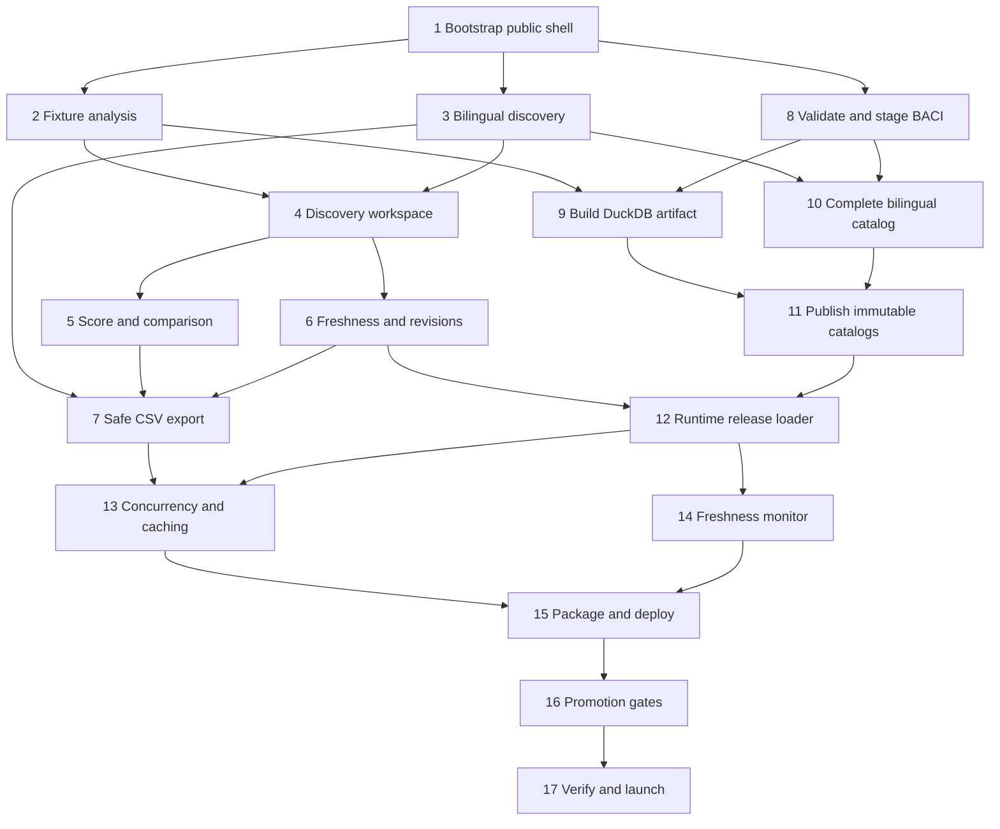

# Public-data HS Tracker MVP specification

**Status:** Decision complete  
**Wayfinder map:** [Chart the public-data HS Tracker MVP](https://github.com/huangyingting/HSTracker/issues/1)  
**Implementation umbrella:** [Build the public-data HS Tracker MVP](https://github.com/huangyingting/HSTracker/issues/7)  
**Implementation slicing decision:** [Slice the decision-complete MVP into implementation tickets](https://github.com/huangyingting/HSTracker/issues/14)  
**Specified:** 2026-07-11

## 1. Outcome

Ship a public, read-only, no-login web application in which an **Export Market
Analyst** can:

1. select one export economy;
2. find and explicitly select one HS 2012 six-digit product in English or
   Simplified Chinese;
3. receive the complete ranked Candidate Market cohort from one immutable BACI
   analysis build;
4. inspect score components, raw evidence, periods, Data Confidence,
   missingness, provisional evidence, and release revisions;
5. compare selected Candidate Markets without recalculating the analysis; and
6. export the complete contextual result as the canonical CSV.

The analyst completes that discovery task without downloading or calculating
raw trade data. A Candidate Market remains evidence for deeper investigation,
not a prediction of sales, profit, or investment success.

This document is the implementation handoff. The linked decision documents own
the exact formulas, fields, copy rules, states, bytes, limits, and operational
targets. GitHub child issues own delivery progress. Neither this specification
nor the umbrella issue silently restates or weakens those contracts.

## 2. Binding product contract

| Area | MVP contract |
|---|---|
| Primary actor | Export Market Analyst |
| Public shape | Browser application, no account, read-only `GET`/`HEAD` surface |
| Source | CEPII BACI HS12, initially `BACI_HS12_V202601.zip` |
| Source years | 2012-2024; 2019-2023 scored, 2024 provisional |
| Product identity | `HS12` plus an exact six-character code |
| Product discovery | Deterministic code/English/Simplified-Chinese lexical search; explicit selection |
| Candidate cohort | Eligible importing economies with at least one recorded positive market flow in the five-year score window |
| Score | `cms-v1`, fixed 30/25/25/20 size/growth/foothold/diversity weights |
| Missing evidence | Unknown/not recorded; never silently converted to a measured zero |
| Confidence | Separate rule-based High/Medium/Low evidence quality; never changes score or rank |
| Workflow | Focused master-detail workspace with a secondary comparison tray |
| Score presentation | Audit worksheet with visible formula, states, evidence, deductions, and caveats |
| Freshness | Exact source scope plus latest-known/update/delayed/overdue operational status |
| Export | Deterministic, complete, bilingual, formula-safe `candidate-markets-csv-v1` |
| Deployment | Self-hosted Next.js Node runtime with read-only DuckDB artifacts |
| Publication | Offline immutable artifacts/catalogs, checksummed and atomically promoted |
| Availability | At least 99.5% monthly request and external-probe SLIs |
| Recurring cost | At most USD 40/month target; architecture review above USD 50/month |

## 3. Canonical decisions

Implementation must consume these contracts:

- [Domain language](../../CONTEXT.md)
- [MVP trade dataset and HS nomenclature](../research/2026-07-11-mvp-trade-dataset-and-hs-nomenclature.md)
- [Candidate Market Score and Data Confidence](../research/2026-07-11-candidate-market-score-and-confidence.md)
- [Candidate Market discovery workflow](https://github.com/huangyingting/HSTracker/issues/3)
- [Public-web data and deployment architecture](../research/2026-07-11-public-web-data-and-deployment-architecture.md)
- [Company-level trade-data extension boundaries](../research/2026-07-11-company-level-trade-data-extension-boundaries.md)
- [HS product descriptions and search language](../research/2026-07-11-hs-product-description-and-search-language.md)
- [Trade-data freshness and provisional presentation](../research/2026-07-11-trade-data-freshness-and-provisional-presentation.md)
- [Candidate Market Score presentation](https://github.com/huangyingting/HSTracker/issues/10)
- [Result export contract](../research/2026-07-11-result-export-contract.md)
- [MVP performance and caching targets](../research/2026-07-11-mvp-performance-and-caching-targets.md)
- [Decision-complete MVP acceptance fixtures](../research/2026-07-11-decision-complete-mvp-acceptance-fixtures.md)

When a summary in an issue conflicts with a linked decision, the linked decision
wins. A genuine contract conflict blocks implementation until it is recorded and
resolved; an agent may not choose a convenient interpretation in code.

## 4. System shape

### 4.1 Runtime

Use a Next.js App Router application in strict TypeScript, running in the Node.js
runtime with standalone output. Use the repository's npm lockfile and pinned
Node/Next.js/DuckDB versions established by the bootstrap slice.

The production process:

- loads one exact deployment manifest;
- verifies and opens current and compatible previous DuckDB artifacts read-only;
- loads one compatible immutable product-search catalog;
- polls one immutable-public-status pointer in the background;
- serves a versioned `GET`/`HEAD` interface and the focused workspace; and
- performs no source ingestion, artifact mutation, or public write operation.

The initial deployment baseline is one always-on Fly.io Machine, one 50-GiB Fly
Volume, and private S3-compatible object storage. Provider-specific code stays
outside domain modules.

### 4.2 Deep modules and seams

The principal deep module is:

```ts
interface CandidateMarketAnalysis {
  analyze(query: {
    analysisBuildId: string
    exporterCode: string
    productCode: string
  }): Promise<CandidateMarketResult>
}
```

Its interface includes deterministic ordering, typed errors, complete result
semantics, and the performance contract. It hides all BACI joins, score windows,
normalization, confidence, stability, discontinuity, revision comparison,
coalescing, and provenance assembly.

Its internal `TradeEvidenceSource` seam has exactly two justified adapters:

- `FixtureTradeEvidenceSource` for `acceptance-fixtures-v1`;
- `DuckDbTradeEvidenceSource` for immutable production artifacts.

Product discovery is a separate deep module:

```ts
interface ProductCatalog {
  search(query: {
    productSearchBuildId: string
    query: string
    locale: "en" | "zh-Hans"
    limit: number
  }): Promise<ProductSearchResult>
}
```

It hides normalization, Traditional-to-Simplified query folding, aliases,
ranking, limits, highlighting evidence, and revision rejection. Fixture and
immutable-catalog adapters meet the same interface.

Freshness evaluation is pure and clock-injected. Production pointer/object-store
access is an adapter behind the runtime freshness implementation; request
handlers consume only a validated snapshot and explicit `asOf` instant.

CSV generation consumes the same `CandidateMarketResult` as JSON/UI plus
compatible product-catalog and freshness identities. It never owns another
score calculation.

Do not add speculative company, auth, provider, repository, or generic service
interfaces. One production adapter plus one fixture adapter justifies a seam;
one adapter alone does not.

### 4.3 Public interface

```text
GET /
GET /api/v1/analyses/current
GET /api/v1/analyses/{analysisBuildId}/economies?q=
GET /api/v1/product-catalogs/{productSearchBuildId}/products?q=&locale=&limit=
GET /api/v1/analyses/{analysisBuildId}/candidate-markets?exporter=&product=
GET /api/v1/analyses/{analysisBuildId}/candidate-markets.csv
    ?exporter=
    &product=
    &productSearchBuildId=
    &freshnessStatusId=
    &schema=candidate-markets-csv-v1
GET /healthz
```

The comparison tray uses the already-loaded complete analysis. No comparison,
raw-data, arbitrary SQL, bulk-query, refresh, or activation endpoint is public.

## 5. Test-first delivery contract

Every implementation issue uses red-green-refactor:

1. add the smallest failing contract/acceptance test for the issue outcome;
2. implement through the named module interface or public route;
3. refactor without weakening observable coverage;
4. run the narrow relevant suite, then the repository's required type, lint,
   build, and affected end-to-end checks;
5. commit fixture/oracle changes only when the issue changes a documented input
   or contract.

The bootstrap slice establishes these stable commands:

```text
npm test
npm run typecheck
npm run lint
npm run build
npm run test:e2e
```

Use Vitest for pure modules and route/adapter integration, Testing Library only
where DOM behavior needs it, and Playwright for the analyst journey. Tests cross
module interfaces and public routes; they do not assert private helper calls,
React implementation structure, or DuckDB table internals already proven by
adapter reconciliation.

`acceptance-fixtures-v1` has three non-substitutable layers:

1. synthetic contract oracles;
2. complete-artifact-derived source/query fixtures;
3. deployment/performance/recovery drills.

A synthetic fixture pass never stands in for a production-artifact gate.

## 6. Delivery milestones

### Milestone A: Fixture-backed analyst loop

The public production build runs against fixture adapters and completes the
entire discover -> analyze -> inspect -> compare -> export journey. This proves
product/domain behavior before source-pipeline and hosting complexity arrives.

Completed by slices 1-7.

### Milestone B: Real immutable BACI release

The offline pipeline validates `V202601`, builds immutable DuckDB and bilingual
search artifacts, publishes compatible catalogs, and serves the same module
interfaces from verified production adapters.

Completed by slices 8-12.

### Milestone C: Production-safe public MVP

Bounded concurrency/caching, freshness failure handling, standalone deployment,
load/recovery/promotion evidence, and the complete public acceptance run meet
the fixed service contract.

Completed by slices 13-17.

## 7. Implementation slices

The [Build the public-data HS Tracker MVP](https://github.com/huangyingting/HSTracker/issues/7)
issue is an umbrella and completion tracker, not an implementation task. Each
slice below becomes its own native sub-issue. Native dependencies, not issue-body
checklists, define readiness.

Every slice carries `ready-for-agent` while open. The implementation frontier is
the first open, unassigned child of the umbrella whose native blockers are all
closed, in native sub-issue order. The umbrella itself does not carry that label
and is never claimed as a work item. The planning map closes after this slicing
decision; implementation scheduling then uses this umbrella frontier rather
than the closed Wayfinder-map frontier.

### Slice 1 - Bootstrap the executable public shell

**Outcome:** A production-buildable Next.js/TypeScript application renders the
public no-login shell and exposes health through one repeatable test harness.

**Owns:**

- npm/Node/TypeScript/Next.js pins and lockfile;
- strict type checking, lint, build, Vitest, and Playwright commands;
- App Router shell, global error/not-found treatment, English/Chinese locale
  switch, discovery disclaimer, and responsive baseline;
- `/healthz` with fixture-safe build identity; and
- CI for the required local commands.

**Acceptance proof:** one failing-then-passing Playwright shell journey, route
health integration, standalone build, and no product/score placeholder logic.

**Dependencies:** none.

### Slice 2 - Serve the core Candidate Market analysis from fixtures

**Outcome:** One versioned HTTP query returns the exact complete
`acceptance-fixtures-v1` Candidate Market result through the deep analysis
module.

**Owns:**

- `CandidateMarketAnalysis` and `TradeEvidenceSource` interfaces;
- `FixtureTradeEvidenceSource`;
- `cms-v1`, component percentiles, rank/ties, confidence, alternate-window
  stability, discontinuity, quantity evidence, typed empty/error outcomes, and
  deterministic result/provenance;
- the 13-market core, microfixtures, empty product, and discontinuity fixtures;
  and
- fixture-backed versioned Candidate Market route.

**Acceptance proof:** exact core score/rank/confidence/stability oracle, all
microfixtures, empty `200`, malformed/unknown errors, deterministic response
bytes, and no score formula outside the module.

**Dependencies:** Slice 1.

### Slice 3 - Add deterministic bilingual HS product discovery

**Outcome:** An analyst can search and explicitly select an HS12 product by code,
English, Simplified Chinese, or supported Traditional input.

**Owns:**

- `ProductCatalog` interface and fixture adapter;
- search normalization/ranking/error contract and mini-catalog fixtures;
- versioned product-search Route Handler;
- accessible debounced combobox, match evidence, keyboard behavior, late-request
  cancellation, explicit selection, locale behavior, and canonical URL identity;
  and
- visible rejection of non-HS12 revision input.

**Acceptance proof:** every golden search case, 20-result cap, ambiguity without
auto-selection, leading-zero/full-width code round trip, and Playwright
keyboard/locale flow.

**Dependencies:** Slice 1.

### Slice 4 - Complete the fixture-backed discovery workspace

**Outcome:** An analyst selects economy/product, activates analysis, and scans a
complete canonical Candidate Market ranking with one adjacent evidence record.

**Owns:**

- export-economy selection and canonical query URL;
- a fixture economy directory and
  `/api/v1/analyses/{analysisBuildId}/economies?q=` Route Handler;
- integration of the ProductCatalog and CandidateMarketAnalysis interfaces;
- Analyze action, complete-result loading milestone, canonical ranked list,
  initial selection, basic evidence/provenance, and discovery language;
- loading, empty, malformed, stale-build-refresh, capacity, and unavailable
  states; and
- navigation/back-forward preservation without accounts.

Economy lookup uses the analysis build's allowlisted individual
economies/territories. Empty `q` returns that complete small directory in numeric
BACI-code order. A non-empty query is NFKC-normalized, trimmed, whitespace
collapsed, and Latin-case-folded; it matches source BACI code, ISO2/ISO3
crosswalk, or source English name by deterministic case-insensitive prefix or
token containment, sorts exact code/crosswalk/name matches before prefix/token
matches and then by numeric BACI code, rejects input over 100 Unicode code
points, and returns at most 50 records. Display remains source English; interface
locale does not change identity or ordering.

During this fixture milestone, the current analysis build is the fixture
manifest constant. A typed retired-build `410` exercises the stale state. Slice
6 later replaces that constant with `/api/v1/analyses/current` discovery and
revalidation.

**Acceptance proof:** fixture browser journey from shell through all 13 ranked
markets, honest empty state, typed recovery behavior, and no partial result
declared interactive; economy fixtures prove empty-directory load, exact
code/ISO/name, prefix/token ordering, cap, invalid length, and explicit
selection of exporter `156`.

**Dependencies:** Slices 2 and 3.

### Slice 5 - Present auditable score evidence and comparison

**Outcome:** The selected Candidate Market has the accepted audit worksheet and
the analyst can compare records from the loaded cohort without a network query.

**Owns:**

- identity/rank/score header and fixed formula;
- four evidence rows with raw value, unit/period, state, rounded percentile,
  weight, and interpretation;
- Data Confidence ledger, sparse cap, missingness, caveats, code 490, quantity,
  and distinct provisional snapshot;
- responsive stacked narrow-screen layout; and
- persistent secondary comparison tray with consistent columns/units.

**Acceptance proof:** Mexico, South Africa, India, code 490, both integer-score
tie groups, provisional-present/absent cases, non-color-only communication, and
zero analysis requests while selecting/comparing.

**Dependencies:** Slice 4.

### Slice 6 - Expose current source scope, freshness, and release revisions

**Outcome:** The analyst can identify the exact source/build/window, operational
freshness, and material release changes without confusing any of them with
historical growth.

**Owns:**

- pure clock-injected freshness state evaluation and immutable effective IDs;
- pure Release Revision comparison and all states/reasons;
- fixture-backed `/api/v1/analyses/current`;
- persistent source-scope strip, source details, status warnings, revision
  evidence, and required copy; and
- exact seven-/14-day boundary and precedence fixtures.

**Acceptance proof:** every status at `T-1s/T/T+1s`, every revision state,
same-window comparison, skipped-release `NOT_COMPARED`, and score/provisional
invariance.

**Dependencies:** Slice 4.

### Slice 7 - Export complete Candidate Market results safely

**Outcome:** The analyst revalidates current context and downloads the exact
complete bilingual `candidate-markets-csv-v1` representation.

**Owns:**

- centralized typed 105-column serializer;
- UTF-8 BOM/CRLF/universal quoting, scalar/list grammar, reversible formula
  protection, deterministic ordering/bytes, and representation guards;
- versioned CSV `GET`/`HEAD` Route Handler with exact identities/errors/headers;
- export preflight and workspace download action; and
- core, empty, formula/control, identity-mutation, and parser round-trip oracles.

**Acceptance proof:** byte fixture and SHA-256, same result as JSON/UI, complete
13-row export despite a three-record comparison tray, empty attributable row,
and static exclusion of raw/supplier/company/bulk-query surfaces.

**Dependencies:** Slices 3, 5, and 6.

### Slice 8 - Validate and stage the pinned BACI release

**Outcome:** One TypeScript CLI turns the exact pinned CEPII ZIP into validated,
year-partitioned Parquet staging plus a reproducible source report.

**Owns:**

- committed `V202601` source descriptor;
- resumable HTTPS download to temporary build storage;
- byte/SHA-256, ZIP-path, member, CRC, header/type, key, year, positivity,
  metadata-join, and coverage validation;
- explicit null quantity and missing-row preservation;
- DuckDB-driven Parquet staging without passing source rows through JavaScript;
  and
- annual counts/drift report with fail-closed approval input.

**Acceptance proof:** small corrupt/safe archive fixtures plus a complete-source
run; no raw ZIP/CSV/Parquet committed; failed validation cannot publish.

**Dependencies:** Slice 1.

### Slice 9 - Build immutable DuckDB analysis artifacts

**Outcome:** Staged `V202601` produces one compact immutable analysis artifact
that serves exactly the same analysis interface as fixtures.

**Owns:**

- artifact schema and ordered `bilateral_year`, `market_year`, `product_year`,
  dimensions, and metadata tables;
- fixed-point aggregation, quantity counts, `ANALYZE`, `CHECKPOINT`, read-only
  reopen, source reconciliation, checksum, and artifact manifest;
- deterministic sparse/median/upper-quartile/maximum query selection;
- `DuckDbTradeEvidenceSource`; and
- fixture/production adapter equivalence at normalized input and public-result
  seams.

**Acceptance proof:** full build report, table/source totals, immutable hash,
read-only integration, core projection parity, actual-size gate, and
maximum-row smoke analysis.

**Dependencies:** Slices 2 and 8.

### Slice 10 - Ship the complete bilingual HS12 product catalog

**Outcome:** All 5,202 source products are discoverable through one accepted,
versioned English/Simplified-Chinese production catalog.

**Owns:**

- byte-preserved BACI English source rows;
- complete auxiliary Chinese catalog with status/source-description checksum;
- deterministic translation/catalog build, terminology/structure checks,
  Traditional query-conversion data, reviewed aliases, and review manifest;
- flagged-row plus risk-stratified bilingual review workflow; and
- immutable production ProductCatalog adapter and build identity.

**Acceptance proof:** 5,202/5,202 source/translation join, every chapter covered
by review, no stale-checksum translation, golden search parity, resident-size
gate, and translation-only changes leaving analysis identity/results unchanged.

**Dependencies:** Slices 3 and 8.

### Slice 11 - Publish immutable release and search catalogs

**Outcome:** Accepted analysis and search artifacts can be uploaded, verified,
paired, promoted, and rolled back without mutating the active publication.

**Owns:**

- immutable private object keys and manifests;
- current/previous analysis release catalog;
- product-search catalog publication;
- exact deployment pairing manifest and compatible IDs;
- upload checksum/read-back, `.partial` download, fsync, atomic rename, promotion,
  rollback, and local S3-compatible integration; and
- separate read-only runtime and write-scoped promotion credentials.

**Acceptance proof:** local object-store publication from candidate artifacts,
failed-upload/pairing continuity, identity mutation matrix, atomic pointer
change, and no private URL/credential in public metadata.

**Dependencies:** Slices 9 and 10.

### Slice 12 - Load verified releases in the Next.js runtime

**Outcome:** The production Next.js process hydrates, verifies, opens, and serves
the paired real release through the already-proven public interfaces.

**Owns:**

- startup deployment-manifest validation;
- local-volume hydration/reuse and checksum/schema compatibility;
- read-only current/previous DuckDB lifecycle and production ProductCatalog;
- current build/search/status identities in health/current routes;
- active-build validation and retired-build `410`; and
- one real-product smoke journey through analysis and search.

**Acceptance proof:** empty-volume and resident-volume startup, incompatible
pairing failure before readiness, real adapter parity, no request-time object
store dependency, and no mixed-release rows.

**Dependencies:** Slices 6 and 11.

### Slice 13 - Bound analytical concurrency and immutable caching

**Outcome:** All analytical/search/export routes remain correct and bounded
under accepted concurrent public traffic.

**Owns:**

- identical-key in-flight coalescing;
- two-computation FIFO semaphore/queue, deadlines, overload response, and actual
  DuckDB cancellation/resource release;
- global DuckDB threads/memory/spill settings;
- byte-weighted analysis/search LRUs with caps/admission/retired-build eviction;
- explicit HTTP cache/ETag/Vary/HEAD/304/no-store matrix; and
- route/cache/queue/query/serialization metrics.

**Acceptance proof:** ten-waiter coalescing, cancellation isolation, queue full
and timeout cases, forced spill, byte eviction/oversize/empty/error cases,
deadline cache boundaries, and target-load no-rejection integration.

**Dependencies:** Slices 7 and 12.

### Slice 14 - Monitor BACI freshness and preserve the last good release

**Outcome:** The production control plane detects source changes and failures
while the public runtime continues serving one exact accepted release with
truthful status.

**Owns:**

- scheduled CEPII source check and release detection;
- immutable public status snapshots plus mutable pointer;
- runtime 55-60-second background pointer poll and embedded startup fallback;
- warning/page timing, explicit refresh failure/rollback status, and private
  diagnostics;
- build/promote orchestration entry point; and
- continuity of last accepted deployment pairing.

**Acceptance proof:** startup/mid-run object-store outage, exact deadline aging,
detected-release/status latency, failed refresh without partial activation,
successful atomic refresh, and skipped-release comparison behavior.

**Dependencies:** Slice 12.

### Slice 15 - Package and deploy the production service

**Outcome:** A candidate production environment runs the complete application on
the accepted host-portable baseline.

**Owns:**

- standalone glibc Docker image, native DuckDB external package, non-root user,
  code-only image, and pinned runtime;
- Fly.io Machine/Volume/TLS/health/restart configuration;
- private object-storage and volume configuration;
- structured logs, secrets/env contract, health/readiness, and restore runbook;
- 50-GiB volume/image/catalog/free-space checks; and
- candidate deployment URL.

**Acceptance proof:** container integration, local and Fly startup, native
binary presence, health/smoke, read-only credentials, restart/hydration/rollback
runbook rehearsal, image/volume gates, and cost forecast.

**Dependencies:** Slices 13 and 14.

### Slice 16 - Prove promotion, performance, and recovery gates

**Outcome:** The candidate deployment produces a retained, reproducible
promotion report that passes every numeric service and operational target.

**Owns:**

- browser lab and Playwright performance scripts;
- single-route benchmark and declared mixed-load generator;
- coalescing/queue/memory/spill/cache/deadline/outage/lifecycle drills;
- request/probe SLIs, metrics, dashboards/alerts, and error-budget arithmetic;
- artifact/volume/image/catalog/cost promotion evaluation; and
- fail-closed promotion report tied to exact builds/artifacts/fixture digest.

**Acceptance proof:** all gates in the performance decision and acceptance
fixture sections 12-14 pass on the intended Machine class; a failed gate leaves
the active pairing unchanged.

**Dependencies:** Slice 15.

### Slice 17 - Verify and launch the public MVP

**Outcome:** One accepted `V202601` release is publicly reachable and the
complete analyst/maintainer Definition of Done is evidenced.

**Owns:**

- full English and Simplified-Chinese production journey;
- source attribution/licence and no-recommendation copy audit;
- canonical URL, empty/error, comparison, freshness, code 490, revision, and CSV
  smoke checks;
- external one-minute probe and public health/analysis/export verification;
- launch evidence comment on the umbrella with URL/build/release/report links;
  and
- rollback readiness without closing or deleting retained immutable artifacts.

**Acceptance proof:** every Definition of Done item below has durable evidence
against the public deployment. This slice closes only itself; the umbrella is
closed after GitHub confirms every implementation child is complete.

**Dependencies:** Slice 16.

## 8. Native dependency graph



Only Slice 1 is initially unblocked. After it closes, fixture/product/source
threads may proceed independently, but the recurring implementation schedule
selects only the first ready umbrella child per run.

## 9. Definition of Done

The MVP is complete only when:

1. every implementation sub-issue is closed with durable commit and acceptance
   evidence;
2. the public URL serves the no-login Next.js application;
3. `V202601`, HS12, 2019-2023 finalized scoring, and separate 2024 provisional
   evidence are active and attributable;
4. all 5,202 source products and accepted Simplified-Chinese records pass the
   catalog/review gate;
5. the complete production DuckDB artifact and immutable catalogs are
   checksummed, retained privately, reproducible, and atomically promoted;
6. the English and Simplified-Chinese analyst journeys pass against production;
7. core JSON/UI/CSV values agree and the complete contextual CSV passes its byte
   contract;
8. no raw BACI, company, auth, write, bulk-query, or recommendation surface was
   introduced;
9. browser, origin, load, memory, spill, cache, lifecycle, availability, volume,
   image, and cost gates pass on the deployed class;
10. external health plus one pinned analysis succeeds and alerts identify the
    active build/release;
11. failed refresh, object-store outage, restart, cold hydration, and rollback
    retain or restore an exact accepted release inside the fixed targets; and
12. the umbrella issue links the public URL, active IDs, release manifest,
    promotion report, acceptance report, and rollback runbook.

No issue closes on a plausible proxy. If credentials or provider capacity block
a production gate, the issue remains open and records the exact blocker rather
than claiming an MVP launch.

## 10. Explicit exclusions

Do not implement:

- accounts, authentication, profiles, saved analyses, billing, alerts, or team
  collaboration;
- personalized weights or recommendations;
- forecasts of sales, profitability, or investment success;
- brand, model, company, buyer, supplier, shipment, bill-of-lading, or entity
  resolution features;
- commercial provider adapters or placeholder company modules;
- raw BACI redistribution, arbitrary SQL, general-purpose bulk queries, or a
  public refresh/activation endpoint;
- silent HS-revision conversion;
- runtime translation or generative/semantic product classification;
- provisional scores/ranks/trends; or
- infrastructure not triggered by measured CDN, vertical-scale, or HA criteria.

## 11. Umbrella reconciliation

The original umbrella predates the settled decisions and contains superseded
phrases such as observed-zero fixtures, request-time export generation dates,
and undecided architecture references. Replace that body with a concise
completion contract pointing here and to native sub-issues.

The umbrella:

- remains open and unassigned while implementation is active;
- is not labelled `ready-for-agent`;
- is the native parent of all 17 implementation issues;
- defines its implementation frontier as open, unassigned `ready-for-agent`
  children with every native blocker closed;
- is blocked by the final launch-verification issue;
- closes only after every child is closed and the Definition of Done evidence is
  linked; and
- does not duplicate child acceptance checklists or Wayfinder decision text.
